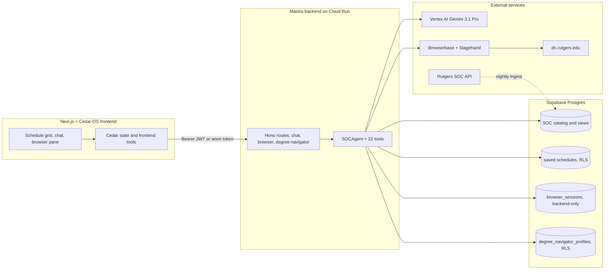

<!--
  Hero demo GIF was produced from the original screen recording with:
    ffmpeg -y -i public/soc-agent-main-demo-video-*.mov \
      -vf "fps=12,scale=960:-1:flags=lanczos,palettegen=stats_mode=diff" \
      -update 1 -frames:v 1 /tmp/soc-palette.png
    ffmpeg -y -i public/soc-agent-main-demo-video-*.mov -i /tmp/soc-palette.png \
      -lavfi "fps=12,scale=960:-1:flags=lanczos[v];[v][1:v]paletteuse=dither=bayer:bayer_scale=5:diff_mode=rectangle" \
      -loop 0 public/soc-agent-demo.gif
  Source .mov files are gitignored. Re-encode after re-recording.
-->

# Rutgers SOC Agent

> An AI scheduling co-pilot for Rutgers students. Search the live Schedule of Classes, build conflict-free schedules, check prerequisites, find empty classrooms, and drive Degree Navigator inside an embedded remote browser — all from one chat.

<p align="center">
  
</p>

<p align="center">
  
  
  
  
  
  
  
  
</p>

---

## Why it exists

Picking a Rutgers schedule means juggling four tabs: the **Schedule of Classes** for sections, **Degree Navigator** for what you actually still need, a prereq checker, and some kind of grid to see if the meeting times even fit. The Rutgers SOC Agent collapses that loop into a single conversation: ask in plain English, watch the agent search the live catalog, check conflicts and prereqs, propose preview schedules you can approve, and — if you sign in — sync your Degree Navigator audit so its suggestions know what you've already taken.

## What it can do

- **Course & section search** by subject, school, core code, instructor, time of day, modality, open-only, and more.
- **Schedule conflict detection** across any number of registration index numbers, with credit totals and warnings.
- **Prerequisite resolution** with parsed AND/OR groups and an "unlocks next" view, grounded in your saved Degree Navigator progress when available.
- **Classroom availability** — find the longest free windows in a building between any two times on a given day.
- **Live schedule mutation** from chat — add, remove, or build **temporary schedule "options"** scoped to the chat thread that you can preview in a carousel and explicitly save to Supabase.
- **Degree Navigator automation** in an embedded **Browserbase Live View**: you log in manually inside the remote browser (no credentials are ever sent to the agent or stored), the agent extracts your declared programs, audit, and transcript into a schema-validated JSON profile, and saves it under your Supabase user.
- **Anonymous trial chat** with backend-signed tokens and a daily message quota — try it without an account; sign in to unlock saved schedules and Degree Navigator sync.

## Try these prompts

Once you're running, drop these into the chat:

- *"Build me a 15-credit Spring 2026 schedule with no Friday classes and at least one CS elective."*
- *"Find an empty classroom in Hill Center between 10 a.m. and noon on Wednesday for at least 90 minutes."*
- *"What are the prerequisites for 198:344, and what does it unlock?"*
- *"Sync my Degree Navigator and tell me what's left for the CS major."*
- *"I'm registered for index 12345 and 67890 — does adding 13579 conflict?"*

## Architecture



The browser talks to **Next.js**; Next streams to the **Mastra HTTP API**; the agent's tools query **Supabase** for SOC catalog and user data; Degree Navigator flows go through a **Browserbase** remote browser; the LLM and Stagehand observe/extract/act calls run on **Vertex AI**. The full canonical map — model, prompt, tool list, Cedar state bridge, route table, and guardrails — lives in [`cedar-mastra-agent/HARNESS.md`](cedar-mastra-agent/HARNESS.md).

## Tech stack

| Layer | Stack |
|---|---|
| Frontend | Next.js 15, React 19, TypeScript 5, Tailwind CSS 4, [Cedar-OS](https://docs.cedarcopilot.com/), AI SDK 5 (`ai`, `@ai-sdk/react`), `@xyflow/react` |
| Agent runtime | [Mastra](https://mastra.ai/docs) (`@mastra/core`), `@mastra/memory` + `@mastra/libsql` (in-memory) |
| Models | Google Vertex AI via `@ai-sdk/google-vertex` — agent: `gemini-3.1-pro-preview`; Stagehand: `vertex/gemini-3.1-pro-preview` |
| Data | Supabase (Postgres + Auth) with custom SOC schema, indexes, and views in [`soc-database/`](soc-database/) |
| Browser automation | Browserbase + Stagehand + `playwright-core`, embedded as a Live View iframe |
| Infra | Node 22, Docker, Google Cloud Build → Cloud Run (frontend + backend), Secret Manager |

## Agent toolset

22 tools registered on `socAgent` in [`cedar-mastra-agent/src/backend/src/mastra/agents/soc-agent.ts`](cedar-mastra-agent/src/backend/src/mastra/agents/soc-agent.ts). Full request/response schemas in [`cedar-mastra-agent/TOOLS-SPEC.md`](cedar-mastra-agent/TOOLS-SPEC.md).

<details>
<summary><strong>SOC data tools (8)</strong></summary>

| Tool | What it does |
|---|---|
| `searchCourses` | Multi-criteria course discovery by subject, school, campus, term, core code, instructor, or keyword. |
| `getCourseDetails` | Full course detail with sections, meetings, instructors, restrictions, core codes. |
| `browseMetadata` | List terms, campuses, subjects, schools, core codes, instructors. |
| `searchSections` | Schedule-builder section search with time/day/modality/open-only filters. |
| `getSectionByIndex` | Exact lookup by 5-digit registration index. |
| `checkScheduleConflicts` | Pairwise meeting-overlap detection with credit totals and warnings. |
| `getPrerequisites` | Parsed prereq rows with human summary and an optional "unlocks" list. |
| `findRoomAvailability` | Longest free intervals per room in a building for a day/time window. |

</details>

<details>
<summary><strong>Browser & Degree Navigator tools (9)</strong></summary>

| Tool | What it does |
|---|---|
| `ensureDegreeNavigatorSession` | Open or reuse the user's Browserbase Degree Navigator session in the embedded pane. |
| `closeBrowserSession` | Release an active Browserbase session. |
| `browserNavigate` | Go to an allowed Rutgers HTTPS URL in the active session (host allowlist enforced). |
| `browserObserve` | Stagehand observation of the current page before risky steps. |
| `browserExtract` | Structured extraction from the current page. |
| `browserAct` | Natural-language UI action; sensitive verbs (`submit`, `confirm`, `register`, `drop`) require a server-issued single-use confirmation token. |
| `readDegreeNavigatorProfile` | Load the latest schema-validated profile saved for the user. |
| `readDegreeNavigatorExtractionRun` | Load a stored extraction run to normalize without re-scraping the live browser. |
| `saveDegreeNavigatorProfile` | Validate and persist the latest capture under the server-derived Supabase `user_id`. |

</details>

<details>
<summary><strong>Frontend schedule tools + interactive (5)</strong></summary>

| Tool | What it does |
|---|---|
| `addSectionToSchedule` | Cedar bridge: add a section to the active schedule grid. |
| `removeSectionFromSchedule` | Cedar bridge: remove a section by index number. |
| `createTemporarySchedule` | Cedar bridge: create a chat-thread-scoped preview option (optionally seeded from the active schedule). |
| `addSectionToTemporarySchedule` | Cedar bridge: append a section to a specific temporary option. |
| `discardTemporarySchedule` | Cedar bridge: drop a preview option from the carousel. |
| `askUserQuestion` | Two-turn handoff with inline option/secret cards; answers return as hidden structured context next turn. |

</details>

## Engineering highlights

- **Two streaming chat pipelines.** Modern AI SDK UI message stream at `POST /chat/ui` and the legacy SSE Mastra workflow at `POST /chat/stream`. Both filter Cedar context server-side so only `activeSchedule` and `browserSession` ever cross the model boundary.
- **Anonymous trial without leaking PII.** Backend-signed anonymous chat tokens with a daily message quota claimed via a Postgres function (`claim_anonymous_chat_message`). Anonymous users can chat; only signed-in users get saved threads, schedules, and Degree Navigator data.
- **Confirmation tokens for destructive browser actions.** `browserAct` calls matching `submit`, `confirm`, `register`, or `drop` are gated by a user confirmation flow that issues a single-use server token before the action executes — see [`cedar-mastra-agent/src/backend/src/browser/actionConfirmation.ts`](cedar-mastra-agent/src/backend/src/browser/actionConfirmation.ts).
- **Schema-validated Degree Navigator captures.** Zod schemas in [`cedar-mastra-agent/src/backend/src/degree-navigator/schemas.ts`](cedar-mastra-agent/src/backend/src/degree-navigator/) validate every saved profile. Storage is one latest row per user, ownership derived from the Supabase JWT (not from anything the client claims). No Rutgers passwords, raw HTML, screenshots, or Live View URLs are persisted.
- **Custom SOC schema with prereq parsing.** [`soc-database/`](soc-database/) ships an idempotent ingestion pipeline, a normalized Postgres schema with views (`v_course_search`, `v_schedule_builder`, `v_section_details`, `v_instructor_stats`), targeted indexes for conflict detection / open-section lookup / instructor analytics, and an HTML prereq parser that produces a queryable AND/OR graph.
- **Cedar "frontend tools" bridge.** The agent doesn't just describe UI changes — it directly invokes typed TypeScript functions in the user's browser via Cedar's `useRegisterFrontendTool`, so chat-driven schedule edits show up instantly on the visible grid.
- **Schedule preview options.** `createTemporarySchedule` produces thread-scoped alternatives that live in browser storage (tagged with the Cedar thread id) and surface as a carousel above the grid. Nothing hits Supabase until the user clicks Save.
- **`askUserQuestion` handoff.** Persistent inline question cards with optional secret-input transport, answer-locked across reloads via `sessionStorage`, and a hidden structured channel for the agent's next turn — modeled on the Claude Code / Codex contract.
- **Hardened Postgres.** Migrations explicitly named `harden_browser_sessions`, `lock_down_soc_catalog`, and `create_degree_navigator_profiles` apply RLS to user tables, lock the SOC catalog to read-only roles, and keep `browser_sessions` backend-only.

## Repo layout

```text
.
├── cedar-mastra-agent/   # Next.js + Cedar-OS frontend, Mastra backend, Supabase migrations — the deployed app
├── soc-database/         # Python ingestion, Postgres schema, prereq parser, fuzzing reports
├── DOCS/                 # Dated incident write-ups and ops notes
├── public/               # Repo-level demo asset (the GIF above)
└── README.md             # You are here
```

## Quickstart

Full prerequisites, env vars, and Cloud setup live in [`cedar-mastra-agent/README.md`](cedar-mastra-agent/README.md). The minimum to get the app running locally:

```bash
git clone <this-repo>
cd rutgers-soc-mastra-agent/cedar-mastra-agent
cp .env.example .env   # fill in Vertex AI, Supabase, and Browserbase credentials

npm install
npm --prefix src/backend install

npm run dev            # Next on :3000, Mastra on :4112
```

You'll need:

- **Node.js 22+**
- A **Supabase** project with the migrations in [`cedar-mastra-agent/supabase/migrations/`](cedar-mastra-agent/supabase/migrations/) applied
- **Google Vertex AI** credentials (or an API-key-backed Stagehand model provider)
- A **Browserbase** API key + project ID for Degree Navigator automation

To populate the SOC catalog from the live Rutgers API, see [`soc-database/README.md`](soc-database/README.md):

```bash
cd soc-database
python ingest_courses.py --year 2026 --term 1 --campus NB --clear
```

## Deployment

Both the frontend and the Mastra backend are containerized and shipped to **Google Cloud Run** through **Cloud Build** triggers, with secrets in **Secret Manager**. See [`cedar-mastra-agent/DEPLOYMENT.md`](cedar-mastra-agent/DEPLOYMENT.md) for the runbook, [`cedar-mastra-agent/cloudbuild.frontend.yaml`](cedar-mastra-agent/cloudbuild.frontend.yaml) and [`cedar-mastra-agent/cloudbuild.backend.yaml`](cedar-mastra-agent/cloudbuild.backend.yaml) for the build pipelines, and [`cedar-mastra-agent/scripts/`](cedar-mastra-agent/scripts/) for trigger / secret rotation / verification scripts.

## Security & privacy

- **No Rutgers credentials are ever captured.** Login happens manually inside the Browserbase Live View iframe; passwords stay in the remote browser.
- **`browser_sessions` are backend-only.** Ownership is derived from the verified Supabase JWT, never from client-side IDs.
- **Browser navigation is host-allowlisted** to approved Rutgers domains.
- **Sensitive `browserAct` calls require an explicit user confirmation + a single-use server-issued token.**
- **RLS on all user tables;** the SOC catalog is read-only for browser roles.
- **Degree Navigator captures are schema-validated** before persistence and contain no passwords, raw HTML, screenshots, or Live View URLs.

Full policy: [`SECURITY.md`](SECURITY.md).

## Documentation

| Doc | What it covers |
|---|---|
| [`cedar-mastra-agent/HARNESS.md`](cedar-mastra-agent/HARNESS.md) | Canonical map of model, prompt, tools, Cedar state, routes, guardrails. |
| [`cedar-mastra-agent/TOOLS-SPEC.md`](cedar-mastra-agent/TOOLS-SPEC.md) | Per-tool request/response schemas. |
| [`cedar-mastra-agent/README.md`](cedar-mastra-agent/README.md) | Full app setup, env vars, API surface, scripts. |
| [`cedar-mastra-agent/DEPLOYMENT.md`](cedar-mastra-agent/DEPLOYMENT.md) | Cloud Build / Cloud Run runbook. |
| [`cedar-mastra-agent/BROWSER_AUTOMATION_PLAN.md`](cedar-mastra-agent/BROWSER_AUTOMATION_PLAN.md) | Browserbase + Stagehand design notes. |
| [`SECURITY.md`](SECURITY.md) | Security posture, threat model, hardening migrations. |
| [`frontend-SPEC.md`](frontend-SPEC.md) | Frontend behavior spec. |
| [`DEGREE_NAVIGATOR_DOCUMENTATION.md`](DEGREE_NAVIGATOR_DOCUMENTATION.md) | Degree Navigator data model and extraction. |
| [`google-cloud-vertex-ai-setup.md`](google-cloud-vertex-ai-setup.md) | Vertex AI provisioning. |
| [`soc-database/README.md`](soc-database/README.md) | SOC ingestion pipeline and schema. |
| [`soc-database/SOC_API_DOCUMENTATION.md`](soc-database/SOC_API_DOCUMENTATION.md) | Rutgers SOC API findings from fuzzing. |
| [`DOCS/`](DOCS/) | Dated incident write-ups. |

## License

No license file is in the repository yet. Until one is added, treat the source as **all rights reserved** by the authors. Security policy is in [`SECURITY.md`](SECURITY.md).
