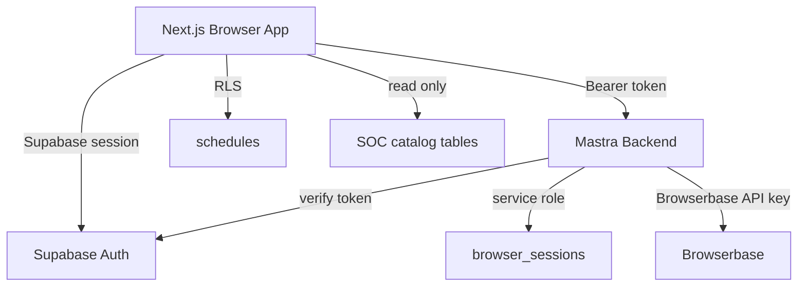

# Security

This document describes the security model and required settings for the Rutgers SOC Mastra Agent application.

Current production status:

- The Cloud Run backend is `rutgers-agent-mastra-backend` in `us-east4`.
- The backend is configured to read `SUPABASE_SERVICE_ROLE_KEY` from Secret Manager.
- The Supabase security migrations `harden_browser_sessions` and `lock_down_soc_catalog` have been applied.

## Security Overview

- Supabase Auth is the source of user identity.
- Backend routes must verify Supabase bearer tokens before performing user-scoped work.
- User-owned data is protected by Supabase Row Level Security (RLS) or backend-only access.
- Rutgers SOC catalog data is public read-only data for frontend roles.
- Rutgers credentials are never collected, stored, logged, or echoed by this application.
- Browser-local IDs and `localStorage` values are convenience state only. They must never be treated as authorization.

## Trust Boundaries



## Authentication And Identity

The frontend Supabase client is configured in [`cedar-mastra-agent/src/lib/supabaseClient.ts`](cedar-mastra-agent/src/lib/supabaseClient.ts) with:

- `NEXT_PUBLIC_SUPABASE_URL`
- `NEXT_PUBLIC_SUPABASE_ANON_KEY`

The frontend may expose only `NEXT_PUBLIC_*` variables. Backend secrets must never be shipped to the browser.

The Mastra backend verifies requests with `Authorization: Bearer <supabase-access-token>`. Verification lives in [`cedar-mastra-agent/src/backend/src/auth/supabaseAuth.ts`](cedar-mastra-agent/src/backend/src/auth/supabaseAuth.ts), and protected routes are wired through [`cedar-mastra-agent/src/backend/src/mastra/apiRegistry.ts`](cedar-mastra-agent/src/backend/src/mastra/apiRegistry.ts).

The server derives the authenticated user ID from the Supabase token. It must not trust any client-provided user identifier, including `browserClientId`, `resourceId`, `threadId`, or values in `localStorage`.

`browserClientId` may exist as non-authoritative client context for UI continuity, but it is not an ownership or authorization source.

## User Data Storage

User-scoped storage is split across Supabase Auth, Supabase Postgres, and browser-local cache.

- `auth.users`: Supabase-owned identity table.
- `public.schedules`: saved schedules owned by `user_id`, protected by RLS with `auth.uid() = user_id`.
- `public.browser_sessions`: backend-only Browserbase session metadata, keyed to authenticated `user_id`.
- Browser `localStorage`: convenience cache and cleanup metadata only.

The schedule table and RLS policy are defined in [`cedar-mastra-agent/supabase/migrations/20260126_create_schedules.sql`](cedar-mastra-agent/supabase/migrations/20260126_create_schedules.sql).

Browser session hardening is defined in [`cedar-mastra-agent/supabase/migrations/20260426_harden_browser_sessions.sql`](cedar-mastra-agent/supabase/migrations/20260426_harden_browser_sessions.sql). That migration:

- Adds `user_id uuid references auth.users`.
- Marks `owner_id` as a legacy, non-authoritative identifier.
- Enables RLS on `public.browser_sessions`.
- Adds a deny-all policy for frontend roles.
- Revokes direct access from `anon` and `authenticated`.

Backend browser-session operations use a service-role Supabase client from [`cedar-mastra-agent/src/backend/src/lib/supabase.ts`](cedar-mastra-agent/src/backend/src/lib/supabase.ts). The service role key must be configured as a backend secret.

## SOC Catalog Data

Rutgers SOC catalog data comes from the Rutgers SOC endpoint ingestion pipeline in [`soc-database/ingest_courses.py`](soc-database/ingest_courses.py) and is shaped by [`soc-database/schema.sql`](soc-database/schema.sql).

SOC catalog tables and views are public catalog data, but frontend roles must be read-only:

- `anon` and `authenticated` may select from SOC tables/views.
- `anon` and `authenticated` must not insert, update, delete, truncate, reference, or trigger SOC catalog tables.
- Ingestion must run through a privileged server-side path, not through browser credentials.

The read-only permission migration is [`cedar-mastra-agent/supabase/migrations/20260426_lock_down_soc_catalog.sql`](cedar-mastra-agent/supabase/migrations/20260426_lock_down_soc_catalog.sql).

## Backend Secrets And Environment Variables

Backend-only settings:

- `SUPABASE_URL`
- `SUPABASE_ANON_KEY`
- `SUPABASE_SERVICE_ROLE_KEY` or `SUPABASE_SERVICE_KEY`
- `BROWSERBASE_API_KEY`
- `BROWSERBASE_PROJECT_ID`
- `BROWSERBASE_API_BASE` optional, defaults to `https://api.browserbase.com/v1`
- `GOOGLE_VERTEX_PROJECT`
- `GOOGLE_VERTEX_LOCATION`
- `GOOGLE_APPLICATION_CREDENTIALS` for local development, or a service account attached to Cloud Run
- `STAGEHAND_MODEL_PROVIDER=vertex` if `browserObserve`, `browserExtract`, or `browserAct` should use Vertex/Gemini
- `STAGEHAND_MODEL_API_KEY` or `OPENAI_API_KEY` as an alternative for API-key-backed Stagehand models
- `STAGEHAND_MODEL_NAME=vertex/gemini-3.1-pro-preview` recommended for Vertex-backed Degree Navigator extraction; use the `vertex/` prefix for Vertex models

Frontend settings:

- `NEXT_PUBLIC_MASTRA_URL`
- `NEXT_PUBLIC_SUPABASE_URL`
- `NEXT_PUBLIC_SUPABASE_ANON_KEY`

Never commit `.env` files, service account JSON files, provider keys, Supabase service-role keys, Browserbase keys, or model provider keys.

## Browser Automation Guardrails

Degree Navigator access runs inside Browserbase Live View. The user signs in manually inside the embedded Browserbase browser. The app and agent must not ask for, store, log, or echo Rutgers credentials.

Browser session security requirements:

- Sessions are owned by authenticated Supabase users.
- Session metadata is stored in backend-only `public.browser_sessions`.
- Active browser session pointers in `localStorage` are cleanup metadata, not authorization.
- Browserbase sessions must be released when the user stops the session, signs out, becomes idle, unloads the page, or when the backend reaper detects stale sessions.

Browser action guardrails:

- `browserNavigate` must restrict navigation to approved Rutgers HTTPS hosts.
- Sensitive actions matching `submit`, `confirm`, `register`, or `drop` require explicit user confirmation.
- Sensitive actions require a server-issued, single-use confirmation token tied to the authenticated user, session, action, and expiry.
- The agent should observe or extract page state before complex browser actions.

Relevant files:

- [`cedar-mastra-agent/src/backend/src/browser/browserService.ts`](cedar-mastra-agent/src/backend/src/browser/browserService.ts)
- [`cedar-mastra-agent/src/backend/src/browser/actionConfirmation.ts`](cedar-mastra-agent/src/backend/src/browser/actionConfirmation.ts)
- [`cedar-mastra-agent/src/backend/src/mastra/tools/browser/browser-act.ts`](cedar-mastra-agent/src/backend/src/mastra/tools/browser/browser-act.ts)

## Agent And Prompt Safety

Client requests may send the user prompt and limited model settings such as `temperature` and `maxTokens`.

Client requests must not control the server system prompt. Server-owned agent instructions live in [`cedar-mastra-agent/src/backend/src/mastra/agents/soc-agent.ts`](cedar-mastra-agent/src/backend/src/mastra/agents/soc-agent.ts), and the chat workflow is implemented in [`cedar-mastra-agent/src/backend/src/mastra/workflows/chatWorkflow.ts`](cedar-mastra-agent/src/backend/src/mastra/workflows/chatWorkflow.ts).

Production logging must avoid full request payloads, full `additionalContext`, credentials, Degree Navigator page data, and provider secrets. Log request metadata instead.

Agent memory is configured in [`cedar-mastra-agent/src/backend/src/mastra/memory.ts`](cedar-mastra-agent/src/backend/src/mastra/memory.ts). It is process-local, ephemeral, and limited to recent messages.

## Local Browser Data

The browser stores some local state for UX and cleanup:

- Supabase persists the auth session in browser storage.
- Schedule workspace data may be cached locally.
- Active Browserbase session metadata may be cached locally so stale sessions can be cleaned up.
- Theme and UI preferences may be stored locally.

Local state is not authoritative for authorization. On sign-out, the app clears app-local schedule data and active browser-session state.

Relevant files:

- [`cedar-mastra-agent/src/lib/scheduleStorage.ts`](cedar-mastra-agent/src/lib/scheduleStorage.ts)
- [`cedar-mastra-agent/src/app/page.tsx`](cedar-mastra-agent/src/app/page.tsx)

## Verification Checklist

Before release or after rotating secrets, verify:

- Supabase migrations have been applied.
- `public.schedules` has RLS enabled and enforces `auth.uid() = user_id`.
- `public.browser_sessions` is not directly accessible to `anon` or `authenticated`.
- SOC catalog writes are revoked from `anon` and `authenticated`.
- Backend service has `SUPABASE_SERVICE_ROLE_KEY` or `SUPABASE_SERVICE_KEY` configured as a secret.
- Backend routes reject missing or invalid bearer tokens.
- Browser navigation rejects non-Rutgers hosts.
- Sensitive browser actions require a server-issued confirmation token.
- Backend tests pass:

```bash
npm --prefix cedar-mastra-agent/src/backend test
```

- Backend build passes:

```bash
npm --prefix cedar-mastra-agent/src/backend run build
```

## Reporting And Rotation

Report security issues to the project maintainers through the repository’s private issue tracker or the team’s internal security channel.

If a secret is exposed:

- Rotate the Supabase service-role key.
- Rotate Browserbase API keys.
- Rotate Vertex/model provider credentials.
- Revoke exposed service account JSON keys.
- Remove exposed values from deployment logs, shell history, and any committed files.
- Audit recent access to Supabase, Browserbase, and cloud provider resources.

Do not open a public issue containing secrets, credentials, private student data, or Degree Navigator content.
