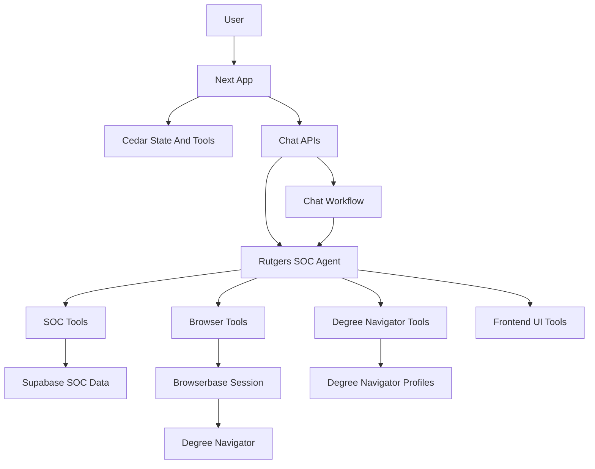

# Agent Harness

This is the canonical map of the Rutgers SOC agent harness: the model, prompt, active tools, frontend state bridge, browser automation, backend APIs, external services, and guardrails that define what the agent can see and do.

Keep detailed SOC tool schemas in [`TOOLS-SPEC.md`](TOOLS-SPEC.md), production runbooks in [`DEPLOYMENT.md`](DEPLOYMENT.md), security policy in [`../SECURITY.md`](../SECURITY.md), and historical browser design notes in [`BROWSER_AUTOMATION_PLAN.md`](BROWSER_AUTOMATION_PLAN.md).

## High-Level Architecture



Primary implementation files:

- Agent definition, model, prompt, and active tool list: [`src/backend/src/mastra/agents/soc-agent.ts`](src/backend/src/mastra/agents/soc-agent.ts)
- Tool registry and Cedar bridge tools: [`src/backend/src/mastra/tools/toolDefinitions.ts`](src/backend/src/mastra/tools/toolDefinitions.ts)
- Chat workflow and context filtering: [`src/backend/src/mastra/workflows/chatWorkflow.ts`](src/backend/src/mastra/workflows/chatWorkflow.ts)
- Frontend state and frontend tools: [`src/app/page.tsx`](src/app/page.tsx)
- Browserbase lifecycle and Stagehand config: [`src/backend/src/browser/browserService.ts`](src/backend/src/browser/browserService.ts)
- Chat, profile, and browser API routes: [`src/backend/src/mastra/apiRegistry.ts`](src/backend/src/mastra/apiRegistry.ts)
- Degree Navigator storage schemas and repository: [`src/backend/src/degree-navigator/`](src/backend/src/degree-navigator/)
- Memory configuration: [`src/backend/src/mastra/memory.ts`](src/backend/src/mastra/memory.ts)

## Agent Runtime

The active Mastra agent export is `socAgent`, with runtime name `SOCAgent`. It uses Google Vertex AI through `createVertex` and currently calls `gemini-3.1-pro-preview`.

The prompt gives the agent Rutgers-specific operating context:

- Campus, term, subject, school, core curriculum, and registration-index conventions.
- SOC search behavior, including term defaults, schedule context, open/closed section handling, prerequisites, conflicts, classroom queries, and search result rendering.
- Temporary schedule option rules for building previewable schedule alternatives without mutating saved schedules.
- Degree Navigator browser automation rules, including no credential handling, Browserbase session state, manual login, and observe-before-act behavior.

Memory is configured in [`src/backend/src/mastra/memory.ts`](src/backend/src/mastra/memory.ts). It uses in-memory LibSQL storage with `lastMessages: 5`, so memory is process-local and clears when the backend process exits.

## What The Agent Can See

There are two chat entry points:

- `/chat/ui` streams AI SDK UI messages directly through `socAgent.stream`, persists messages, supports authenticated and anonymous principals, and passes filtered Cedar context as a system context message.
- `/chat/stream` runs the older Mastra `chatWorkflow` SSE path for authenticated users.

Both paths can pass:

- The user message.
- Optional `temperature` and `maxTokens`.
- A `RuntimeContext` containing `additionalContext`, stream helpers, and the authenticated user id when present.
- Memory identifiers derived on the server from the authenticated user or anonymous client, not from trusted client ownership claims.

The workflow filters model-visible Cedar context to:

- `activeSchedule`: current schedule, visible blocks, temporary schedule options, preview option, sync status, term, campus, sections, and credits.
- `browserClientId`: hidden in chat UI and non-authoritative. It is client continuity state only.
- `browserSession`: hidden in chat UI and contains the current Browserbase session metadata.

The frontend registers additional mutable Cedar state such as `browserSession` setters and search result setters, but `searchResults` is a UI target rather than model-visible context.

The app does not collect or store Rutgers credentials. Degree Navigator login happens inside the embedded Browserbase Live View, and credentials should remain inside that remote browser session.

### Asking The User Flow

When the agent needs an explicit choice from the user, it calls the `askUserQuestion` tool. This is a two-turn handoff, not a server-side suspension:

1. The backend tool ([`src/backend/src/mastra/tools/ask-user-question.ts`](src/backend/src/mastra/tools/ask-user-question.ts)) emits a non-transient `data-ask_user_question` UI event with `{ questionId, questions[] }`, then returns immediately with `{ status: "asked", questionId }`. `questionId` is the request-level id; each question also has a stable per-question `id` used as the answer key. The agent is instructed to end its turn after calling.
2. The frontend renders the data part as an inline card ([`src/cedar/components/chatMessages/AskUserQuestion.tsx`](src/cedar/components/chatMessages/AskUserQuestion.tsx) in [`SocChatMessages.tsx`](src/cedar/components/vercelChat/SocChatMessages.tsx)). The user selects option(s) or types a custom answer when `isOther` is enabled. Secret free-text inputs use password-style fields and are redacted from the visible transcript.
3. The card calls `dispatchCedarPrompt` with a concise visible summary like `User answered: Priority -> Requirement progress (Recommended)` plus hidden model-only context containing `[AskUserQuestion answers] {...}`. The backend persists only the visible summary in chat history and passes the hidden structured answer to the agent for that turn.

The data event is non-transient, so the card is part of the persisted assistant message and re-renders after a page reload. The card tracks its answered state in `sessionStorage` keyed by `questionId` so a submitted card stays locked across re-renders within the session. If no stream/UI controller is available, the backend tool fails fast instead of waiting for input.

When Degree Navigator data is saved, the backend stores a validated latest capture in `public.degree_navigator_profiles`. The stored document includes profile fields, declared programs, audits, transcript terms, and run notes. It does not include Rutgers passwords, raw HTML, screenshots, or Browserbase Live View URLs.

## Active Agent Tools

The authoritative runtime surface is `socAgent.tools` in [`src/backend/src/mastra/agents/soc-agent.ts`](src/backend/src/mastra/agents/soc-agent.ts). [`src/backend/src/mastra/tools/toolDefinitions.ts`](src/backend/src/mastra/tools/toolDefinitions.ts) also keeps broader categorized registries for organization and shared bridge tools, but `socAgent.tools` decides what this agent can call.

### SOC Data Tools

These tools read Rutgers SOC data from Supabase-backed tables/views:

- `searchCourses`: find courses by course string, title, subject, school, campus, term, core code, instructor, or keyword-style criteria.
- `getCourseDetails`: fetch detailed course, section, availability, meeting, instructor, and restriction information.
- `browseMetadata`: browse available terms, campuses, subjects, schools, and related metadata.
- `searchSections`: search schedule-builder-oriented sections with meeting, instructor, location, campus, status, modality, and time filters.
- `getSectionByIndex`: look up a specific section by its 5-digit registration index.
- `checkScheduleConflicts`: compare sections for meeting-time conflicts.
- `getPrerequisites`: retrieve prerequisite information for a course.
- `findRoomAvailability`: find open classroom windows by building, day, time range, and duration.

### Browserbase And Degree Navigator Tools

These tools operate on the Browserbase-hosted Degree Navigator session owned by the authenticated user:

- `ensureDegreeNavigatorSession`: open or reuse the Browserbase Degree Navigator session shown in the embedded browser pane.
- `closeBrowserSession`: release an active Browserbase session.
- `browserNavigate`: navigate the existing remote browser session to an allowed Rutgers URL.
- `browserObserve`: inspect the current page before taking action.
- `browserExtract`: extract structured information from the current page.
- `browserAct`: perform a natural-language action in the active browser session.
- `readDegreeNavigatorProfile`: read the latest saved Degree Navigator profile for the authenticated user.
- `readDegreeNavigatorExtractionRun`: read a stored extraction run for the authenticated user.
- `saveDegreeNavigatorProfile`: validate and save a Degree Navigator profile capture for the authenticated user.

`browserAct` requires explicit confirmation for sensitive actions matching `submit`, `confirm`, `register`, or `drop`.

`createBrowserSession` exists in the broader tool registry, but the active agent uses `ensureDegreeNavigatorSession` so the frontend can open or reuse the pane-backed session.

### Interactive Tools

- `askUserQuestion`: ask the user 1–4 structured questions inline in chat only after non-mutating exploration cannot resolve a decision that materially affects the work. Mirrors the Claude Code / Codex `AskUserQuestion` contract: each question has a stable `id`, ≤12-char `header`, clear question ending in `?`, optional `multiSelect`, optional `isOther`, optional `isSecret`, and optional 2–4 label+description choices. Recommended/default choices go first and end with `(Recommended)`. Optional previews support markdown or sanitized HTML. Calling this is a two-turn handoff — see [Asking The User](#asking-the-user-flow) below.

Schedule Builder mode should use **one** high-leverage `askUserQuestion` call when possible. The best timing is after reading the user's profile, active schedule, target credits, and enough SOC/search context to know the real trade-offs, but before creating temporary schedules. The default question should ask what would make the schedule feel most successful (`schedule_win`: degree progress, manageable load, weekly fit, electives), with the agent's inferred best option first and marked `(Recommended)`. If every useful option would otherwise break a stated constraint, use the single question slot for constraint relaxation instead. Never ask more than once per Schedule Builder run.

### Frontend Schedule Tools

These active tools mutate browser-local schedule UI state through Cedar bridge tools:

- `addSectionToSchedule`: add a course section to the current in-browser schedule. Use only when the user explicitly wants to add or lock in a section.
- `removeSectionFromSchedule`: remove a course section from the current schedule by index number.
- `createTemporarySchedule`: create a chat-thread-scoped schedule option that the user can preview without writing to saved schedules.
- `addSectionToTemporarySchedule`: add a course section to a temporary schedule by the agent-supplied `scheduleId`.
- `discardTemporarySchedule`: remove a temporary schedule from the chat-thread option carousel.

Temporary schedules persist in the user's local browser storage tagged with the Cedar chat thread id. They are hidden from the saved schedule dropdown and Supabase sync until the user clicks Save in the option carousel above the grid.

### Registered Frontend Tools And State Setters

The frontend registers direct Cedar frontend tools in [`src/app/page.tsx`](src/app/page.tsx):

- `addSectionToSchedule`
- `removeSectionFromSchedule`
- `createTemporarySchedule`
- `addSectionToTemporarySchedule`
- `discardTemporarySchedule`
- `ensureDegreeNavigatorSession`
- `closeDegreeNavigatorSession`
- `refreshSessionStatus`

The shared Cedar registry also defines state setter tools for `searchResults` and `browserSession`, including `clearSearchResults`, `setSearchResults`, `appendSearchResults`, `setBrowserSession`, and `clearBrowserSession`. These are registry/bridge utilities, not currently part of `socAgent.tools` unless they are explicitly registered on the agent.

## Browserbase And Degree Navigator Harness

Browserbase is used as a remote browser runtime so Rutgers pages do not need to be scripted inside a cross-origin iframe.

The session flow is:

1. The signed-in frontend calls `/browser/session/create` with a Supabase bearer token and target `degree_navigator`.
2. The backend verifies the token, derives the Supabase `user_id`, creates a Browserbase session with `keepAlive: true`, a bounded timeout, viewport settings, and user metadata.
3. The backend opens `https://dn.rutgers.edu/` through the Browserbase connection.
4. The backend resolves an embeddable Live View URL.
5. The frontend stores `browserSession`, persists cleanup metadata, and renders the Live View URL in an iframe.
6. The user logs in manually inside the Browserbase iframe.
7. The frontend checks Degree Navigator readiness and can trigger extraction once the app appears ready.
8. The agent can use browser tools against the same session, scoped by the authenticated Supabase user.
9. Stop Session, auto-stop, startup cleanup, close beacon, or the backend reaper release the Browserbase session with `REQUEST_RELEASE`.

Browserbase sessions are tracked in the backend session repository. Session ownership is enforced by server-derived Supabase `user_id`; `browserClientId` is retained only as non-authoritative client context. The frontend keeps active-session metadata in local storage so stale sessions can be cleaned up on startup.

`browserObserve`, `browserExtract`, and `browserAct` use Stagehand and require model credentials. Initial Degree Navigator navigation uses a non-LLM browser connection, so a model key is not required just to launch the Live View.

Structured Degree Navigator captures are validated by [`src/backend/src/degree-navigator/schemas.ts`](src/backend/src/degree-navigator/schemas.ts) and read/written through [`src/backend/src/degree-navigator/repository.ts`](src/backend/src/degree-navigator/repository.ts). The repository uses the backend Supabase service-role client, while route handlers derive ownership from the authenticated Supabase user.

## API Surface

The backend registers routes in [`src/backend/src/mastra/apiRegistry.ts`](src/backend/src/mastra/apiRegistry.ts).

Chat routes:

- `GET /chat/threads`: list authenticated chat threads.
- `POST /chat/threads`: create an authenticated chat thread.
- `POST /chat/thread`: read one authenticated chat thread and its messages.
- `PATCH /chat/thread`: rename an authenticated chat thread.
- `DELETE /chat/thread`: delete an authenticated chat thread.
- `POST /chat/anonymous/session`: create or refresh a limited anonymous chat session.
- `POST /chat/ui`: stream AI SDK UI messages for authenticated or anonymous chat.
- `POST /chat/suggestions`: generate short follow-up suggestions for an authenticated thread.
- `POST /chat/stream`: stream the legacy authenticated SSE workflow response.

Degree Navigator profile routes:

- `GET /degree-navigator/profile`: read the latest profile for the authenticated user.
- `POST /degree-navigator/profile`: validate, enrich, and save the latest profile capture for the authenticated user.
- `DELETE /degree-navigator/profile`: delete the authenticated user's saved profile.

Browser session routes:

- `POST /browser/session/create`: create a Browserbase Degree Navigator session.
- `POST /browser/session/status`: fetch and update local status for an owned Browserbase session.
- `POST /browser/session/degree-navigator-readiness`: classify whether the current session appears logged in and ready for extraction.
- `POST /browser/session/degree-navigator-extract`: store raw extraction evidence from the active Degree Navigator session.
- `POST /browser/session/close`: close/release an owned Browserbase session and return termination metadata.
- `POST /browser/session/close-beacon`: best-effort close endpoint for pagehide/beforeunload cleanup.

## Guardrails And Limits

- The agent must not ask for, store, log, or echo Rutgers passwords.
- Rutgers login occurs manually inside Browserbase Live View.
- Browser sessions and Degree Navigator data are scoped to the authenticated Supabase user.
- Browser-local IDs and local storage values are not authorization sources.
- Browser navigation is restricted to approved Rutgers HTTPS hosts.
- Sensitive browser actions require explicit user confirmation and a server-issued confirmation token before `browserAct` executes.
- The agent should observe or extract before complex browser actions.
- Saved Degree Navigator captures must be schema-validated and user-owned by server-derived Supabase `user_id`.
- Memory is process-local, ephemeral, and limited to the last 5 messages.
- Schedule tools can mutate frontend-local UI state; use temporary schedules for exploratory schedule options.
- Closed sections can be added to the local schedule if the user asks; the agent should warn, not block.
- Technical errors should be surfaced with exact messages.

## Operational Requirements

Backend environment variables:

- `GOOGLE_VERTEX_PROJECT`
- `GOOGLE_VERTEX_LOCATION`
- `GOOGLE_APPLICATION_CREDENTIALS` for local key-file auth, or workload credentials in Cloud Run
- `SUPABASE_URL`
- `SUPABASE_ANON_KEY`
- `SUPABASE_SERVICE_ROLE_KEY` or `SUPABASE_SERVICE_KEY`
- `ANONYMOUS_CHAT_TOKEN_SECRET` recommended for stable anonymous chat tokens; falls back to the Supabase service key if omitted
- `ANONYMOUS_CHAT_DAILY_MESSAGE_LIMIT` optional anonymous trial quota override
- `BROWSERBASE_API_KEY`
- `BROWSERBASE_PROJECT_ID`
- `BROWSERBASE_API_BASE` optional, defaults to `https://api.browserbase.com/v1`
- `STAGEHAND_MODEL_PROVIDER=vertex` for Stagehand-backed browser observe/extract/act tools through Vertex/Gemini, or `STAGEHAND_MODEL_API_KEY` / `OPENAI_API_KEY` for API-key-backed models
- `STAGEHAND_MODEL_NAME=vertex/gemini-3.1-pro-preview` recommended for Vertex-backed Degree Navigator extraction; if omitted, Vertex mode falls back to `vertex/gemini-3-flash-preview`, and API-key mode falls back to `gpt-4o-mini`

When using Stagehand Vertex mode, keep the `vertex/` prefix in `STAGEHAND_MODEL_NAME`; the backend removes the prefix before calling the Vertex AI SDK. The agent model itself uses the unprefixed `gemini-3.1-pro-preview` name.

Frontend environment variables:

- `NEXT_PUBLIC_MASTRA_URL`
- `NEXT_PUBLIC_SUPABASE_URL`
- `NEXT_PUBLIC_SUPABASE_ANON_KEY`

For local development, start the root app through the repo script so `.env` is loaded for both Next and Mastra:

```bash
npm run dev
```

If starting Mastra alone, load the project `.env` explicitly from `cedar-mastra-agent`:

```bash
npx dotenv -e .env -- npm --prefix src/backend run dev
```

## Keeping This Updated

Update this file whenever any of these change:

- The agent model, system prompt, runtime name, or memory behavior.
- Tools registered on `socAgent.tools`.
- `TOOL_REGISTRY`, `SOC_TOOLS`, `ALL_TOOLS`, or Cedar bridge tools.
- `useRegisterState`, `useSubscribeStateToAgentContext`, or `useRegisterFrontendTool` usage in the frontend.
- Browserbase session creation, readiness, extraction, termination, ownership, or Stagehand behavior.
- Chat, profile, or browser API routes.
- Degree Navigator profile or extraction storage, validation, or route behavior.
- Required environment variables or deployment assumptions.

Prefer short capability descriptions and source links here. Keep detailed request/response schemas in source files or specialized docs such as [`TOOLS-SPEC.md`](TOOLS-SPEC.md).
