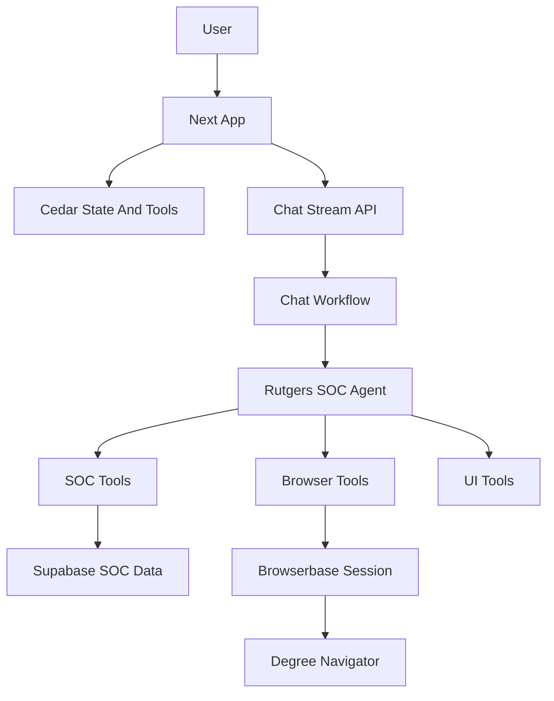

# Agent Harness

This document is the canonical map of the Rutgers SOC agent harness: the model, prompt, tools, frontend state, browser automation, APIs, external services, and guardrails that define what the agent can see and do.

For detailed Rutgers SOC tool schemas and query behavior, see [`TOOLS-SPEC.md`](TOOLS-SPEC.md). For the Browserbase design notes, see [`BROWSER_AUTOMATION_PLAN.md`](BROWSER_AUTOMATION_PLAN.md). For deployment variables, see [`DEPLOYMENT.md`](DEPLOYMENT.md).

## High-Level Architecture



The primary implementation files are:

- Agent definition and prompt: [`src/backend/src/mastra/agents/soc-agent.ts`](src/backend/src/mastra/agents/soc-agent.ts)
- Tool registry and Cedar bridge tools: [`src/backend/src/mastra/tools/toolDefinitions.ts`](src/backend/src/mastra/tools/toolDefinitions.ts)
- Chat workflow and context injection: [`src/backend/src/mastra/workflows/chatWorkflow.ts`](src/backend/src/mastra/workflows/chatWorkflow.ts)
- Frontend state and frontend tools: [`src/app/page.tsx`](src/app/page.tsx)
- Browserbase lifecycle: [`src/backend/src/browser/browserService.ts`](src/backend/src/browser/browserService.ts)
- Chat and browser API routes: [`src/backend/src/mastra/apiRegistry.ts`](src/backend/src/mastra/apiRegistry.ts)
- Memory configuration: [`src/backend/src/mastra/memory.ts`](src/backend/src/mastra/memory.ts)

## Agent Identity And Model

The Mastra agent is named `Rutgers SOC Agent`. It uses Google Vertex AI through `createVertex` and currently calls `gemini-3.1-pro-preview`.

The system prompt gives the agent Rutgers-specific operating context:

- Rutgers campus, term, subject, school, core curriculum, and registration-index knowledge.
- SOC search behavior, including term defaults, open/closed section handling, prerequisites, conflicts, classroom queries, and search result rendering.
- Degree Navigator browser automation rules, including no credential handling, browser session ownership, confirmation for sensitive actions, and observe-before-act behavior.

Memory is configured in [`src/backend/src/mastra/memory.ts`](src/backend/src/mastra/memory.ts). It uses an in-memory LibSQL store and keeps the last 5 messages per thread/resource. Memory is ephemeral and clears when the backend process exits.

## What The Agent Can See

The chat workflow sends the agent:

- The current user prompt.
- Optional `temperature`, `maxTokens`, and `systemPrompt` overrides from the chat request.
- `resourceId` and `threadId` for memory scoping when both are present.
- Serialized `additionalContext` from Cedar as background knowledge.

The frontend subscribes these state values into agent context:

- `mainText`: visible in chat context.
- `browserClientId`: hidden in chat UI, used for Browserbase session ownership.
- `browserSession`: hidden in chat UI, contains current Browserbase session metadata.

The frontend also registers `searchResults` as Cedar state, but it is used as a mutable UI target rather than subscribed into agent context.

The app does not collect or store Rutgers credentials. Degree Navigator login happens inside the embedded Browserbase Live View, and credentials should remain inside that remote browser session.

## What The Agent Can Do

The active agent tool surface is registered in [`src/backend/src/mastra/agents/soc-agent.ts`](src/backend/src/mastra/agents/soc-agent.ts). The broader categorized registry is in [`src/backend/src/mastra/tools/toolDefinitions.ts`](src/backend/src/mastra/tools/toolDefinitions.ts).

`TOOL_REGISTRY` also contains helper categories such as `browserState` and `docs`. Those are useful for internal organization and future registration, but the authoritative runtime list for this agent is `socAgent.tools`.

### SOC Data Tools

These tools read Rutgers SOC data from Supabase-backed tables/views:

- `searchCourses`: find courses by course string, title, subject, school, campus, term, core code, or keyword-style criteria.
- `getCourseDetails`: fetch detailed course, section, availability, meeting, instructor, and restriction information.
- `browseMetadata`: browse available terms, campuses, subjects, schools, and related metadata.
- `searchSections`: search schedule-builder-oriented sections with meeting, instructor, location, campus, status, and time filters.
- `getSectionByIndex`: look up a specific section by its 5-digit registration index.
- `checkScheduleConflicts`: compare sections for meeting-time conflicts.
- `getPrerequisites`: retrieve prerequisite information for a course.
- `findRoomAvailability`: find open classroom windows by building, day, time range, and duration.

Detailed inputs and outputs belong in [`TOOLS-SPEC.md`](TOOLS-SPEC.md), not in this harness overview.

### Browserbase And Degree Navigator Tools

These tools operate on a Browserbase-hosted browser session for Degree Navigator:

- `createBrowserSession`: create a Browserbase session for Degree Navigator.
- `closeBrowserSession`: release an active Browserbase session.
- `browserNavigate`: navigate the existing remote browser session to a URL.
- `browserObserve`: inspect the current page before taking action.
- `browserExtract`: extract structured information from the current page.
- `browserAct`: perform a natural-language action in the active browser session.

`browserAct` requires explicit confirmation for sensitive actions matching `submit`, `confirm`, `register`, or `drop`.

### Frontend And UI Tools

These tools mutate browser-local UI state through Cedar bridge tools:

- `changeText`: replace the `mainText` state value.
- `addNewTextLine`: append a displayed assistant note line.
- `addSectionToSchedule`: add a course section to the local in-browser schedule.
- `removeSectionFromSchedule`: remove a course section from the local in-browser schedule by index number.
- `clearSearchResults`: clear the search result cards.
- `setSearchResults`: replace search result cards.
- `appendSearchResults`: append result cards.

The frontend also registers direct Cedar frontend tools in [`src/app/page.tsx`](src/app/page.tsx):

- `launchDegreeNavigatorSession`: launch Browserbase and load Degree Navigator in the embedded browser pane.
- `closeDegreeNavigatorSession`: close the active Browserbase session.
- `refreshSessionStatus`: refresh active Browserbase session status.

## Browserbase And Degree Navigator Harness

Browserbase is used as a remote browser runtime so Rutgers pages do not need to be directly scripted inside a cross-origin iframe.

The session flow is:

1. The frontend calls `/browser/session/create` with `browserClientId` and target `degree_navigator`.
2. The backend creates a Browserbase session with `keepAlive: true`, a bounded timeout, and `userMetadata`.
3. The backend opens `https://dn.rutgers.edu/` through the Browserbase connection.
4. The backend resolves an embeddable Live View URL.
5. The frontend stores `browserSession` and renders the Live View URL in an iframe.
6. The user logs in manually inside the Browserbase iframe.
7. The agent can use browser tools against the same session, scoped by `browserClientId`.
8. Stop Session, auto-stop, startup cleanup, close beacon, or the backend reaper release the Browserbase session with `REQUEST_RELEASE`.

Browserbase sessions are tracked in the backend session repository. Session ownership is enforced by `browserClientId`. The frontend keeps an active-session record in local storage so stale sessions can be cleaned up on startup.

`browserObserve`, `browserExtract`, and `browserAct` use Stagehand and require model credentials. Initial Degree Navigator navigation uses a non-LLM browser connection so a model key is not required just to launch the Live View.

## API Surface

The backend registers these HTTP routes in [`src/backend/src/mastra/apiRegistry.ts`](src/backend/src/mastra/apiRegistry.ts):

- `POST /chat/stream`: stream chat responses and tool call events from the Mastra workflow.
- `POST /browser/session/create`: create a Browserbase Degree Navigator session.
- `POST /browser/session/status`: fetch and update local status for an owned Browserbase session.
- `POST /browser/session/close`: close/release an owned Browserbase session and return termination metadata.
- `POST /browser/session/close-beacon`: best-effort close endpoint for pagehide/beforeunload cleanup.

## Guardrails And Limits

- The agent should not ask for, store, or echo Rutgers passwords.
- Rutgers login occurs manually inside Browserbase Live View.
- Browser actions are scoped to the current `browserClientId`.
- Sensitive browser actions require explicit user confirmation before `browserAct` is called.
- The agent should observe or extract before complex browser actions.
- Memory is process-local, ephemeral, and limited to the last 5 messages.
- Search result and schedule tools can mutate frontend-local UI state.
- Closed sections can be added to the local schedule if the user asks; the agent should warn, not block.
- Technical errors should be surfaced with exact messages.

## Operational Requirements

Backend environment variables:

- `GOOGLE_VERTEX_PROJECT`
- `GOOGLE_VERTEX_LOCATION`
- `GOOGLE_APPLICATION_CREDENTIALS`
- `SUPABASE_URL`
- `SUPABASE_ANON_KEY`
- `BROWSERBASE_API_KEY`
- `BROWSERBASE_PROJECT_ID`
- `BROWSERBASE_API_BASE` optional, defaults to `https://api.browserbase.com/v1`
- `STAGEHAND_MODEL_API_KEY` or `OPENAI_API_KEY` for Stagehand-backed browser observe/extract/act tools
- `STAGEHAND_MODEL_NAME` optional, defaults to `gpt-4o-mini`

Frontend environment variables:

- `NEXT_PUBLIC_MASTRA_URL`
- `NEXT_PUBLIC_SUPABASE_URL`
- `NEXT_PUBLIC_SUPABASE_ANON_KEY`

For local development, start the root app through the repo script so `.env` is loaded for both Next and Mastra:

```bash
pnpm dev
```

If starting Mastra alone, load the project `.env` explicitly from `cedar-mastra-agent`:

```bash
npx dotenv -e .env -- npm --prefix src/backend run dev
```

## Keeping This Updated

Update this file whenever any of these change:

- The agent model, system prompt, or memory behavior.
- Tools registered on `socAgent.tools`.
- `TOOL_REGISTRY`, `SOC_TOOLS`, or Cedar bridge tools.
- `useRegisterState`, `useSubscribeStateToAgentContext`, or `useRegisterFrontendTool` usage in the frontend.
- Browserbase session creation, termination, ownership, or Stagehand behavior.
- Chat or browser API routes.
- Required environment variables or deployment assumptions.

Prefer short capability descriptions and source links here. Keep detailed request/response schemas in source files or specialized docs such as [`TOOLS-SPEC.md`](TOOLS-SPEC.md).
