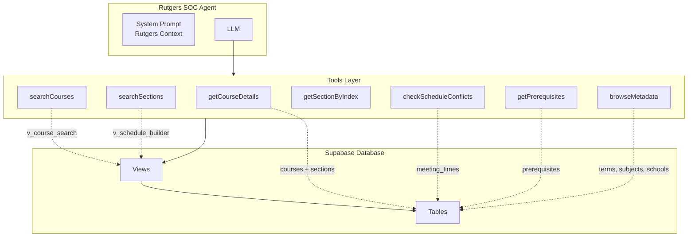

# Rutgers SOC Agent - Tools Specification

> Comprehensive specification for the Rutgers Schedule of Classes (SOC) Mastra agent tools.

---

## Table of Contents

1. [Architecture Overview](#architecture-overview)
2. [Database Connection](#database-connection)
3. [Term Auto-Detection](#term-auto-detection)
4. [Tool Specifications](#tool-specifications)
   - [searchCourses](#1-searchcourses)
   - [getCourseDetails](#2-getcoursedetails)
   - [searchSections](#3-searchsections)
   - [getSectionByIndex](#4-getsectionbyindex)
   - [checkScheduleConflicts](#5-checkscheduleconflicts)
   - [getPrerequisites](#6-getprerequisites)
   - [browseMetadata](#7-browsemetadata)
5. [Agent Behavior Rules](#agent-behavior-rules)
6. [Schedule Building (Future)](#schedule-building-future-enhancement)
7. [Shared Utilities](#shared-utilities)
8. [Agent System Prompt](#agent-system-prompt)
9. [Environment Configuration](#environment-configuration)
10. [Implementation Checklist](#implementation-checklist)

---

## Architecture Overview



### Tool Relationship Patterns

| User Intent | Primary Tool | Follow-up Tools |
|-------------|--------------|-----------------|
| "Find CS classes" | `searchCourses` | `getCourseDetails` |
| "Is CS 111 open?" | `getCourseDetails` | - |
| "Classes on M/W afternoons" | `searchSections` | `getSectionByIndex` |
| "Will these classes conflict?" | `checkScheduleConflicts` | - |
| "What's needed for CS 211?" | `getPrerequisites` | `searchCourses` |
| "What subjects exist?" | `browseMetadata` | `searchCourses` |

---

## Database Connection

### Client: Supabase JS

```typescript
import { createClient } from '@supabase/supabase-js';

const supabase = createClient(
  process.env.SUPABASE_URL!,
  process.env.SUPABASE_ANON_KEY!
);
```

### Database Types

Generate TypeScript types from the schema:

```bash
npx supabase gen types typescript --project-id <project-id> > src/types/database.ts
```

---

## Term Auto-Detection

The agent defaults to the term students are most likely **registering for**, not the currently-active term. This provides a better UX since students typically search for upcoming courses.

### Term Codes

| Code | Term | Typical Date Range |
|------|------|-------------------|
| `0` | Winter | Dec 15 - Jan 20 |
| `1` | Spring | Jan 21 - May 15 |
| `7` | Summer | May 16 - Aug 15 |
| `9` | Fall | Aug 16 - Dec 14 |

### Registration Windows (Approximate)

| Current Month | Default Term | Reason |
|---------------|--------------|--------|
| Nov - Jan | Spring | Spring registration open |
| Feb - Mar | Spring | Current term |
| Apr - Jul | Fall | Fall registration open |
| Aug - Sep | Fall | Current term |
| Oct | Spring (next year) | Spring registration opens |

### Detection Logic

```typescript
function getDefaultTerm(): { year: number; term: string; termName: string } {
  const now = new Date();
  const month = now.getMonth() + 1; // 1-12
  let year = now.getFullYear();
  
  // Default to the term students are most likely REGISTERING for
  // (not the currently-active term)
  // Rule: Switch to next term after ~75% of current term has passed
  
  if (month >= 11 || month === 1) {
    // Nov-Jan: Registration for Spring
    return { year: month >= 11 ? year + 1 : year, term: '1', termName: 'Spring' };
  } else if (month >= 2 && month <= 3) {
    // Feb-Mar: Still Spring (current term)
    return { year, term: '1', termName: 'Spring' };
  } else if (month >= 4 && month <= 7) {
    // Apr-Jul: Registration for Fall
    return { year, term: '9', termName: 'Fall' };
  } else if (month >= 8 && month <= 9) {
    // Aug-Sep: Fall (current term)
    return { year, term: '9', termName: 'Fall' };
  } else {
    // Oct: Transition to Spring registration
    return { year: year + 1, term: '1', termName: 'Spring' };
  }
}
```

> **Note**: Winter (term 0) and Summer (term 7) are not defaulted to automatically. Users must explicitly request these terms since they are supplementary sessions.

---

## Tool Specifications

---

### 1. searchCourses

**Purpose**: Flexible multi-criteria course discovery. This is the primary tool for finding courses.

**Use Cases**:
- "Find Computer Science courses"
- "Show me 3-credit QQ courses"
- "Graduate level Math classes with open sections"
- "Courses taught by Professor Smith"

#### Input Schema

```typescript
const searchCoursesInput = z.object({
  query: z.string().optional()
    .describe('Full-text search on course title (e.g., "machine learning", "calculus")'),
  
  subject: z.string().optional()
    .describe('Subject code (e.g., "198" for Computer Science, "640" for Mathematics)'),
  
  level: z.enum(['U', 'G']).optional()
    .describe('Academic level: U=Undergraduate, G=Graduate'),
  
  credits: z.number().optional()
    .describe('Exact credit hours (e.g., 3, 4)'),
  
  creditsMin: z.number().optional()
    .describe('Minimum credits for range search'),
  
  creditsMax: z.number().optional()
    .describe('Maximum credits for range search'),
  
  campus: z.enum(['NB', 'NK', 'CM']).optional()
    .describe('Campus: NB=New Brunswick, NK=Newark, CM=Camden. Defaults to NB'),
  
  includeOnline: z.boolean().default(true)
    .describe('Include ONLINE_{campus} results (e.g., ONLINE_NB). Defaults to true'),
  
  year: z.number().optional()
    .describe('Academic year (e.g., 2025). Auto-detected if not specified'),
  
  term: z.enum(['0', '1', '7', '9']).optional()
    .describe('Term: 0=Winter, 1=Spring, 7=Summer, 9=Fall. Auto-detected if not specified'),
  
  coreCode: z.string().optional()
    .describe('Core curriculum code (e.g., "QQ", "HST", "WCr", "WCd", "NS", "SCL")'),
  
  hasOpenSections: z.boolean().optional()
    .describe('If true, only return courses with at least one open section'),
  
  instructor: z.string().optional()
    .describe('Instructor name (partial match, case-insensitive)'),
  
  schoolCode: z.string().optional()
    .describe('School/offering unit code (e.g., "01" for SAS, "14" for Engineering)'),
  
  limit: z.number().min(1).max(100).default(25)
    .describe('Maximum results to return (1-100, default 25)'),
  
  offset: z.number().min(0).default(0)
    .describe('Pagination offset'),
});
```

#### Output Schema

```typescript
const searchCoursesOutput = z.object({
  courses: z.array(z.object({
    courseString: z.string(),        // "01:198:111"
    title: z.string(),               // "INTRO COMPUTER SCI"
    expandedTitle: z.string(),       // "INTRODUCTION TO COMPUTER SCIENCE"
    credits: z.number().nullable(),  // 4 or null for "by arrangement"
    level: z.string(),               // "U" or "G"
    subjectCode: z.string(),         // "198"
    subjectName: z.string(),         // "Computer Science"
    schoolCode: z.string(),          // "01"
    schoolName: z.string(),          // "School of Arts and Sciences"
    openSections: z.number(),        // Count of open sections
    totalSections: z.number(),       // Total sections
    campus: z.string(),              // "NB"
    year: z.number(),                // 2025
    term: z.string(),                // "1"
    termName: z.string(),            // "Spring"
    coreCodes: z.array(z.string()),  // ["QQ", "NS"]
  })),
  totalCount: z.number(),
  hasMore: z.boolean(),
  searchContext: z.object({
    year: z.number(),
    term: z.string(),
    termName: z.string(),
    campus: z.string(),
  }),
});
```

#### SQL Query Pattern

```sql
-- Uses v_course_search view with dynamic filters
SELECT 
  c.id,
  c.course_string,
  c.title,
  c.expanded_title,
  c.credits,
  c.level,
  c.open_sections,
  COUNT(s.id) as total_sections,
  v.year,
  v.term,
  v.term_name,
  v.campus,
  v.school_code,
  v.school_name,
  v.subject_code,
  v.subject_name,
  COALESCE(
    (SELECT array_agg(DISTINCT cc.core_code) 
     FROM course_core_codes cc 
     WHERE cc.course_id = c.id), 
    ARRAY[]::varchar[]
  ) as core_codes
FROM v_course_search v
JOIN courses c ON c.id = v.id
LEFT JOIN sections s ON s.course_id = c.id
-- JOINs for instructor filtering
LEFT JOIN section_instructors si ON si.section_id = s.id
LEFT JOIN instructors i ON si.instructor_id = i.id
WHERE v.year = $year
  AND v.term = $term
  -- Campus filter with includeOnline support
  -- When includeOnline = true, include both physical campus and ONLINE_{campus}
  AND (
    v.campus = $campus 
    OR ($includeOnline = true AND v.campus = 'ONLINE_' || $campus)
  )
  -- Dynamic filters added based on input
  AND ($subject::text IS NULL OR v.subject_code = $subject)
  AND ($query::text IS NULL OR to_tsvector('english', c.title) @@ plainto_tsquery($query))
  AND ($level::text IS NULL OR c.level = $level)
  AND ($credits::int IS NULL OR c.credits = $credits)
  AND ($creditsMin::int IS NULL OR c.credits >= $creditsMin)
  AND ($creditsMax::int IS NULL OR c.credits <= $creditsMax)
  AND ($hasOpenSections::boolean IS NULL OR c.open_sections > 0)
  -- School filter
  AND ($schoolCode::text IS NULL OR v.school_code = $schoolCode)
  -- Instructor filter (partial match, case-insensitive)
  AND ($instructor::text IS NULL OR i.name ILIKE '%' || $instructor || '%')
  -- Core code filter
  AND ($coreCode::text IS NULL OR EXISTS (
    SELECT 1 FROM course_core_codes cc 
    WHERE cc.course_id = c.id AND cc.core_code = $coreCode
  ))
GROUP BY c.id, v.year, v.term, v.term_name, v.campus, 
         v.school_code, v.school_name, v.subject_code, v.subject_name
ORDER BY c.subject_code, c.course_number
LIMIT $limit OFFSET $offset;
```

> **Implementation Note**: The `includeOnline` parameter expands the campus filter to include both the physical campus (e.g., `NB`) and its online variant (e.g., `ONLINE_NB`). When `includeOnline = false`, only the physical campus is searched.

#### Example

**Input**:
```json
{
  "subject": "198",
  "level": "U",
  "hasOpenSections": true,
  "limit": 5
}
```

**Output**:
```json
{
  "courses": [
    {
      "courseString": "01:198:111",
      "title": "INTRO COMPUTER SCI",
      "expandedTitle": "INTRODUCTION TO COMPUTER SCIENCE",
      "credits": 4,
      "level": "U",
      "subjectCode": "198",
      "subjectName": "Computer Science",
      "schoolCode": "01",
      "schoolName": "School of Arts and Sciences",
      "openSections": 3,
      "totalSections": 12,
      "campus": "NB",
      "year": 2025,
      "term": "1",
      "termName": "Spring",
      "coreCodes": []
    }
  ],
  "totalCount": 47,
  "hasMore": true,
  "searchContext": {
    "year": 2025,
    "term": "1",
    "termName": "Spring",
    "campus": "NB"
  }
}
```

#### Error Handling

| Condition | Response |
|-----------|----------|
| No results | Return empty `courses` array with `totalCount: 0` |
| Invalid subject code | Return empty results (not an error) |
| Database error | Throw with message: `"Failed to search courses: {error}"` |

---

### 2. getCourseDetails

**Purpose**: Get comprehensive details for a specific course including all sections, meeting times, instructors, and prerequisites.

**Use Cases**:
- "Tell me about CS 111"
- "What sections are available for Calc 1?"
- "Show me the details for 01:640:151"

#### Input Schema

```typescript
const getCourseDetailsInput = z.object({
  courseString: z.string()
    .describe('Full course identifier (e.g., "01:198:111") OR subject:course format (e.g., "198:111")'),
  
  year: z.number().optional()
    .describe('Academic year. Auto-detected if not specified'),
  
  term: z.enum(['0', '1', '7', '9']).optional()
    .describe('Term code. Auto-detected if not specified'),
  
  campus: z.enum(['NB', 'NK', 'CM']).default('NB')
    .describe('Campus code'),
});
```

#### Output Schema

```typescript
const getCourseDetailsOutput = z.object({
  course: z.object({
    courseString: z.string(),
    title: z.string(),
    expandedTitle: z.string(),
    credits: z.number().nullable(),
    creditsDescription: z.string(),
    level: z.string(),
    levelName: z.string(),            // "Undergraduate" or "Graduate"
    
    subject: z.object({
      code: z.string(),
      name: z.string(),
    }),
    
    school: z.object({
      code: z.string(),
      name: z.string(),
    }),
    
    description: z.string().nullable(),
    synopsisUrl: z.string().nullable(),
    courseNotes: z.string().nullable(),
    prereqNotes: z.string().nullable(),  // Raw HTML
    
    coreCodes: z.array(z.object({
      code: z.string(),
      description: z.string(),
    })),
    
    campusLocations: z.array(z.object({
      code: z.string(),
      name: z.string(),
    })),
    
    openSections: z.number(),
    totalSections: z.number(),
  }),
  
  // NOTE: Sections are returned as a flat array in Phase 1.
  // See "Linked Section Grouping (Phase 2)" for future grouped output.
  sections: z.array(z.object({
    indexNumber: z.string(),          // Registration index
    sectionNumber: z.string(),        // "01", "02", etc.
    isOpen: z.boolean(),
    statusText: z.string(),           // "OPEN" or "CLOSED"
    
    instructors: z.array(z.string()), // ["SMITH, JOHN", "DOE, JANE"]
    
    meetingTimes: z.array(z.object({
      day: z.string(),                // "M", "T", "W", "H", "F"
      dayName: z.string(),            // "Monday", "Tuesday", etc.
      startTime: z.string(),          // "10:20 AM"
      endTime: z.string(),            // "11:40 AM"
      startTimeMilitary: z.string(),  // "1020"
      endTimeMilitary: z.string(),    // "1140"
      building: z.string(),           // "HLL"
      room: z.string(),               // "116"
      campus: z.string(),             // "Busch"
      mode: z.string(),               // "LEC", "REC", "LAB"
      isOnline: z.boolean(),
    })),
    
    sectionType: z.string(),          // "T", "H", "O"
    sectionTypeName: z.string(),      // "Traditional", "Hybrid", "Online"
    
    examCode: z.string(),
    finalExam: z.string().nullable(),
    
    eligibility: z.string().nullable(),
    specialPermission: z.string().nullable(),
    comments: z.array(z.string()),
    
    // IMPORTANT: For summer (term 7) and winter (term 0), sessionDates
    // should be displayed PROMINENTLY since timing varies significantly.
    // Format: "05/27/2025 - 07/03/2025"
    sessionDates: z.string().nullable(),
  })),
  
  term: z.object({
    year: z.number(),
    term: z.string(),
    termName: z.string(),
    campus: z.string(),
  }),
});
```

> **Summer/Winter Sessions**: The `sessionDates` field is critical for summer and winter terms. Always display it prominently in responses since sessions have different start/end dates.

#### SQL Query Pattern

```sql
-- Main course query
SELECT 
  c.*,
  t.year, t.term, t.term_name, t.campus,
  sc.code as school_code, sc.description as school_name,
  sub.code as subject_code, sub.description as subject_name
FROM courses c
JOIN terms t ON c.term_id = t.id
LEFT JOIN schools sc ON c.school_id = sc.id
LEFT JOIN subjects sub ON c.subject_id = sub.id
WHERE c.course_string = $1
  AND t.year = $2
  AND t.term = $3
  AND t.campus = $4;

-- Sections with instructors (separate query or join)
SELECT 
  s.*,
  array_agg(DISTINCT i.name) as instructors
FROM sections s
LEFT JOIN section_instructors si ON s.id = si.section_id
LEFT JOIN instructors i ON si.instructor_id = i.id
WHERE s.course_id = $course_id
GROUP BY s.id
ORDER BY s.section_number;

-- Meeting times for each section
SELECT * FROM meeting_times WHERE section_id = ANY($section_ids);

-- Core codes
SELECT core_code, core_code_description 
FROM course_core_codes 
WHERE course_id = $course_id;

-- Campus locations for the course
SELECT code, description AS name
FROM course_campus_locations
WHERE course_id = $course_id;

-- Section comments for each section
SELECT code, description 
FROM section_comments 
WHERE section_id = $section_id;
```

> **Implementation Note**: The main course query, sections query, meeting times, and child table queries (core codes, campus locations, comments) can be executed in parallel after the course ID is known. Alternatively, use subqueries to reduce round-trips.

#### Example

**Input**:
```json
{
  "courseString": "01:198:111"
}
```

**Output** (truncated):
```json
{
  "course": {
    "courseString": "01:198:111",
    "title": "INTRO COMPUTER SCI",
    "expandedTitle": "INTRODUCTION TO COMPUTER SCIENCE",
    "credits": 4,
    "level": "U",
    "levelName": "Undergraduate",
    "subject": { "code": "198", "name": "Computer Science" },
    "school": { "code": "01", "name": "School of Arts and Sciences" },
    "openSections": 3,
    "totalSections": 12,
    "coreCodes": []
  },
  "sections": [
    {
      "indexNumber": "09214",
      "sectionNumber": "01",
      "isOpen": true,
      "statusText": "OPEN",
      "instructors": ["MENENDEZ, FRANCISCO"],
      "meetingTimes": [
        {
          "day": "M",
          "dayName": "Monday",
          "startTime": "10:20 AM",
          "endTime": "11:40 AM",
          "building": "HLL",
          "room": "116",
          "campus": "Busch",
          "mode": "LEC",
          "isOnline": false
        }
      ],
      "sectionType": "T",
      "sectionTypeName": "Traditional"
    }
  ],
  "term": {
    "year": 2025,
    "term": "1",
    "termName": "Spring",
    "campus": "NB"
  }
}
```

#### Error Handling

| Condition | Response |
|-----------|----------|
| Course not found | Throw: `"Course {courseString} not found for {term} {year}"` |
| Invalid course string format | Throw: `"Invalid course format. Use XX:XXX:XXX (e.g., 01:198:111)"` |

---

### 3. searchSections

**Purpose**: Find sections based on schedule criteria like day, time, instructor, or availability.

**Use Cases**:
- "Find open sections on Monday and Wednesday"
- "Evening classes after 5 PM"
- "Online sections for CS courses"
- "Sections taught by Dr. Smith"

#### Input Schema

```typescript
const searchSectionsInput = z.object({
  courseString: z.string().optional()
    .describe('Limit to specific course (e.g., "01:198:111")'),
  
  subject: z.string().optional()
    .describe('Limit to subject code (e.g., "198")'),
  
  openOnly: z.boolean().default(true)
    .describe('Only return sections with open enrollment'),
  
  instructor: z.string().optional()
    .describe('Filter by instructor name (partial match)'),
  
  days: z.array(z.enum(['M', 'T', 'W', 'H', 'F', 'S', 'U'])).optional()
    .describe('Filter by meeting days (M=Mon, T=Tue, W=Wed, H=Thu, F=Fri, S=Sat, U=Sun)'),
  
  timeAfter: z.string().optional()
    .describe('Sections starting at or after this time (24hr format: "0900", "1400")'),
  
  timeBefore: z.string().optional()
    .describe('Sections ending at or before this time (24hr format: "1700", "2100")'),
  
  online: z.boolean().optional()
    .describe('If true, only online sections. If false, only in-person.'),
  
  campus: z.enum(['NB', 'NK', 'CM']).default('NB'),
  
  includeOnline: z.boolean().default(true)
    .describe('Include ONLINE_{campus} results (e.g., ONLINE_NB). Defaults to true'),
  
  year: z.number().optional(),
  term: z.enum(['0', '1', '7', '9']).optional(),
  
  limit: z.number().min(1).max(100).default(25),
  offset: z.number().min(0).default(0),
});
```

#### Output Schema

```typescript
const searchSectionsOutput = z.object({
  sections: z.array(z.object({
    indexNumber: z.string(),
    sectionNumber: z.string(),
    
    course: z.object({
      courseString: z.string(),
      title: z.string(),
      credits: z.number().nullable(),
      subjectCode: z.string(),
    }),
    
    isOpen: z.boolean(),
    instructors: z.array(z.string()),
    
    meetingTimes: z.array(z.object({
      day: z.string(),
      dayName: z.string(),
      startTime: z.string(),
      endTime: z.string(),
      location: z.string(),      // "HLL 116 (Busch)" or "Online"
      mode: z.string(),
    })),
    
    sectionType: z.string(),
    isOnline: z.boolean(),
    
    // For summer (term 7) and winter (term 0), display sessionDates prominently
    sessionDates: z.string().nullable(),
  })),
  
  totalCount: z.number(),
  hasMore: z.boolean(),
});
```

#### SQL Query Pattern

```sql
SELECT DISTINCT
  s.id,
  s.index_number,
  s.section_number,
  s.open_status,
  c.course_string,
  c.title,
  c.credits,
  c.subject_code,
  s.section_course_type
FROM sections s
JOIN courses c ON s.course_id = c.id
JOIN terms t ON c.term_id = t.id
LEFT JOIN meeting_times mt ON mt.section_id = s.id
LEFT JOIN section_instructors si ON si.section_id = s.id
LEFT JOIN instructors i ON si.instructor_id = i.id
WHERE t.year = $year
  AND t.term = $term
  -- Campus filter with includeOnline support
  AND (
    t.campus = $campus 
    OR ($includeOnline = true AND t.campus = 'ONLINE_' || $campus)
  )
  -- Dynamic filters
  AND ($open_only = false OR s.open_status = true)
  AND ($instructor IS NULL OR i.name ILIKE '%' || $instructor || '%')
  AND ($days IS NULL OR mt.meeting_day = ANY($days))
  AND ($time_after IS NULL OR mt.start_time_military >= $time_after)
  AND ($time_before IS NULL OR mt.end_time_military <= $time_before)
  -- meeting_mode_code '90' = Online/Asynchronous (see Shared Utilities)
  AND ($online IS NULL OR (mt.meeting_mode_code = '90') = $online)
ORDER BY c.subject_code, c.course_number, s.section_number
LIMIT $limit OFFSET $offset;
```

#### Example

**Input**:
```json
{
  "subject": "198",
  "days": ["M", "W"],
  "timeAfter": "1400",
  "openOnly": true,
  "limit": 10
}
```

**Output**:
```json
{
  "sections": [
    {
      "indexNumber": "09254",
      "sectionNumber": "05",
      "course": {
        "courseString": "01:198:111",
        "title": "INTRO COMPUTER SCI",
        "credits": 4,
        "subjectCode": "198"
      },
      "isOpen": true,
      "instructors": ["MENENDEZ, FRANCISCO"],
      "meetingTimes": [
        {
          "day": "M",
          "dayName": "Monday",
          "startTime": "2:50 PM",
          "endTime": "4:10 PM",
          "location": "HLL 116 (Busch)",
          "mode": "LEC"
        },
        {
          "day": "W",
          "dayName": "Wednesday",
          "startTime": "2:50 PM",
          "endTime": "4:10 PM",
          "location": "HLL 116 (Busch)",
          "mode": "LEC"
        }
      ],
      "sectionType": "T",
      "isOnline": false
    }
  ],
  "totalCount": 15,
  "hasMore": true
}
```

---

### 4. getSectionByIndex

**Purpose**: Direct lookup of a specific section by its registration index number.

**Use Cases**:
- "Get details for section 09214"
- "Is index 12345 open?"
- "When does section 09214 meet?"

#### Input Schema

```typescript
const getSectionByIndexInput = z.object({
  indexNumber: z.string()
    .regex(/^\d{5}$/, 'Index must be exactly 5 digits (e.g., "09214")')
    .describe('5-digit registration index number (e.g., "09214"). Must be exactly 5 digits including leading zeros.'),
  
  // Optional - helps narrow search if index is reused across terms
  year: z.number().optional(),
  term: z.enum(['0', '1', '7', '9']).optional(),
});
```

> **Validation**: Index numbers must be exactly 5 digits. Input like `"9214"` will be rejected - use `"09214"` instead.

#### Output Schema

```typescript
const getSectionByIndexOutput = z.object({
  section: z.object({
    indexNumber: z.string(),
    sectionNumber: z.string(),
    isOpen: z.boolean(),
    statusText: z.string(),
    
    course: z.object({
      courseString: z.string(),
      title: z.string(),
      expandedTitle: z.string(),
      credits: z.number().nullable(),
      subjectCode: z.string(),
      subjectName: z.string(),
    }),
    
    instructors: z.array(z.string()),
    
    meetingTimes: z.array(z.object({
      day: z.string(),
      dayName: z.string(),
      startTime: z.string(),
      endTime: z.string(),
      startTimeMilitary: z.string(),
      endTimeMilitary: z.string(),
      building: z.string(),
      room: z.string(),
      campus: z.string(),
      mode: z.string(),
      isOnline: z.boolean(),
    })),
    
    sectionType: z.string(),
    sectionTypeName: z.string(),
    examCode: z.string(),
    finalExam: z.string().nullable(),
    eligibility: z.string().nullable(),
    specialPermission: z.string().nullable(),
    comments: z.array(z.string()),
    sessionDates: z.string().nullable(),
  }),
  
  term: z.object({
    year: z.number(),
    term: z.string(),
    termName: z.string(),
    campus: z.string(),
  }),
});
```

#### Example

**Input**:
```json
{
  "indexNumber": "09214"
}
```

**Output**:
```json
{
  "section": {
    "indexNumber": "09214",
    "sectionNumber": "01",
    "isOpen": true,
    "statusText": "OPEN",
    "course": {
      "courseString": "01:198:111",
      "title": "INTRO COMPUTER SCI",
      "credits": 4,
      "subjectCode": "198",
      "subjectName": "Computer Science"
    },
    "instructors": ["MENENDEZ, FRANCISCO"],
    "meetingTimes": [
      {
        "day": "M",
        "dayName": "Monday",
        "startTime": "10:20 AM",
        "endTime": "11:40 AM",
        "building": "HLL",
        "room": "116",
        "campus": "Busch",
        "mode": "LEC",
        "isOnline": false
      }
    ],
    "sectionType": "T",
    "sectionTypeName": "Traditional"
  },
  "term": {
    "year": 2025,
    "term": "1",
    "termName": "Spring",
    "campus": "NB"
  }
}
```

#### Error Handling

| Condition | Response |
|-----------|----------|
| Invalid index format | Throw: `"Index must be exactly 5 digits (e.g., '09214')"` |
| Section not found | Throw: `"Section with index {indexNumber} not found"` |
| Multiple sections (different terms) | Return most recent, note in response |

---

### 5. checkScheduleConflicts

**Purpose**: Detect time conflicts between multiple sections for schedule building.

**Use Cases**:
- "Do sections 09214 and 12345 conflict?"
- "Can I take all of these classes together?"
- "Build me a schedule with CS 111, Math 151, and Expository Writing"

#### Input Schema

```typescript
const checkScheduleConflictsInput = z.object({
  sectionIndices: z.array(z.string()).min(2).max(10)
    .describe('Array of section index numbers to check for conflicts (2-10 sections)'),
  
  year: z.number().optional()
    .describe('Academic year. Auto-detected if not specified'),
  
  term: z.enum(['0', '1', '7', '9']).optional()
    .describe('Term code. Auto-detected if not specified'),
  
  campus: z.enum(['NB', 'NK', 'CM']).default('NB')
    .describe('Campus code'),
});
```

> **Note**: If `year`/`term` are not specified, defaults to the auto-detected registration term. All sections must be from the same term for conflict detection to be meaningful.

#### Output Schema

```typescript
const checkScheduleConflictsOutput = z.object({
  hasConflicts: z.boolean(),
  
  conflicts: z.array(z.object({
    section1: z.object({
      indexNumber: z.string(),
      courseString: z.string(),
      title: z.string(),
    }),
    section2: z.object({
      indexNumber: z.string(),
      courseString: z.string(),
      title: z.string(),
    }),
    day: z.string(),
    dayName: z.string(),
    overlap: z.object({
      start: z.string(),
      end: z.string(),
    }),
  })),
  
  schedule: z.array(z.object({
    indexNumber: z.string(),
    courseString: z.string(),
    title: z.string(),
    credits: z.number().nullable(),
    isOpen: z.boolean(),
    meetings: z.array(z.object({
      day: z.string(),
      dayName: z.string(),
      startTime: z.string(),
      endTime: z.string(),
      location: z.string(),
    })),
  })),
  
  totalCredits: z.number().nullable(),
  
  warnings: z.array(z.string()),  // e.g., "Section 09214 is CLOSED"
});
```

#### Conflict Detection Logic

```typescript
function timesOverlap(
  start1: string, end1: string,  // Military format: "1020", "1140"
  start2: string, end2: string
): boolean {
  const s1 = parseInt(start1), e1 = parseInt(end1);
  const s2 = parseInt(start2), e2 = parseInt(end2);
  return s1 < e2 && s2 < e1;  // Overlap if one starts before other ends
}

function findConflicts(sections: SectionWithMeetings[]): Conflict[] {
  const conflicts: Conflict[] = [];
  
  for (let i = 0; i < sections.length; i++) {
    for (let j = i + 1; j < sections.length; j++) {
      for (const mt1 of sections[i].meetingTimes) {
        for (const mt2 of sections[j].meetingTimes) {
          if (mt1.day === mt2.day && mt1.day !== '') {
            if (timesOverlap(
              mt1.startTimeMilitary, mt1.endTimeMilitary,
              mt2.startTimeMilitary, mt2.endTimeMilitary
            )) {
              conflicts.push({
                section1: sections[i],
                section2: sections[j],
                day: mt1.day,
                overlap: calculateOverlap(mt1, mt2),
              });
            }
          }
        }
      }
    }
  }
  
  return conflicts;
}
```

#### Example

**Input**:
```json
{
  "sectionIndices": ["09214", "12345", "67890"]
}
```

**Output**:
```json
{
  "hasConflicts": true,
  "conflicts": [
    {
      "section1": {
        "indexNumber": "09214",
        "courseString": "01:198:111",
        "title": "INTRO COMPUTER SCI"
      },
      "section2": {
        "indexNumber": "12345",
        "courseString": "01:640:151",
        "title": "CALCULUS I"
      },
      "day": "M",
      "dayName": "Monday",
      "overlap": {
        "start": "10:20 AM",
        "end": "11:00 AM"
      }
    }
  ],
  "schedule": [
    {
      "indexNumber": "09214",
      "courseString": "01:198:111",
      "title": "INTRO COMPUTER SCI",
      "credits": 4,
      "isOpen": true,
      "meetings": [
        {
          "day": "M",
          "dayName": "Monday",
          "startTime": "10:20 AM",
          "endTime": "11:40 AM",
          "location": "HLL 116 (Busch)"
        }
      ]
    }
  ],
  "totalCredits": 11,
  "warnings": []
}
```

---

### 6. getPrerequisites

**Purpose**: Analyze prerequisite requirements for a course and find what courses it unlocks.

**Use Cases**:
- "What are the prerequisites for CS 211?"
- "What can I take after Calc 1?"
- "Show me the prereq chain for Data Structures"

#### Input Schema

```typescript
const getPrerequisitesInput = z.object({
  courseString: z.string()
    .describe('Course to analyze (e.g., "01:198:211")'),
  
  includeUnlocks: z.boolean().default(true)
    .describe('Also return courses that require this course as a prerequisite'),
  
  year: z.number().optional(),
  term: z.enum(['0', '1', '7', '9']).optional(),
  campus: z.enum(['NB', 'NK', 'CM']).default('NB'),
});
```

#### Output Schema

```typescript
const getPrerequisitesOutput = z.object({
  course: z.object({
    courseString: z.string(),
    title: z.string(),
  }),
  
  prerequisites: z.array(z.object({
    courseString: z.string(),
    title: z.string(),
    logicGroup: z.number(),    // Group number for OR relationships
    isOr: z.boolean(),         // True if this is part of an OR group
    existsInDatabase: z.boolean(),  // True if course exists in current term
  })),
  
  prereqNotes: z.string().nullable(),  // Raw HTML for complex cases
  
  prereqSummary: z.string(),  // Human-readable: "Requires (Calc I OR Calc Honors) AND Intro CS"
  
  unlocks: z.array(z.object({
    courseString: z.string(),
    title: z.string(),
  })).optional(),
});
```

#### SQL Query Pattern

```sql
-- Get prerequisites for a course
SELECT 
  p.required_course_string,
  p.required_course_title,
  p.logic_group,
  p.is_or,
  (SELECT EXISTS(
    SELECT 1 FROM courses c2 
    JOIN terms t2 ON c2.term_id = t2.id
    WHERE c2.course_string = p.required_course_string
      AND t2.year = $year AND t2.term = $term
  )) as exists_in_database
FROM prerequisites p
JOIN courses c ON p.course_id = c.id
JOIN terms t ON c.term_id = t.id
WHERE c.course_string = $course_string
  AND t.year = $year
  AND t.term = $term
  AND t.campus = $campus
ORDER BY p.logic_group, p.id;

-- Get courses that require this one (unlocks)
SELECT DISTINCT
  c.course_string,
  c.title
FROM prerequisites p
JOIN courses c ON p.course_id = c.id
JOIN terms t ON c.term_id = t.id
WHERE p.required_course_string = $course_string
  AND t.year = $year
  AND t.term = $term
  AND t.campus = $campus;
```

#### Example

**Input**:
```json
{
  "courseString": "01:198:211",
  "includeUnlocks": true
}
```

**Output**:
```json
{
  "course": {
    "courseString": "01:198:211",
    "title": "COMPUTER ARCHITECTURE"
  },
  "prerequisites": [
    {
      "courseString": "01:198:111",
      "title": "INTRO COMPUTER SCI",
      "logicGroup": 0,
      "isOr": false,
      "existsInDatabase": true
    },
    {
      "courseString": "01:198:112",
      "title": "DATA STRUCTURES",
      "logicGroup": 1,
      "isOr": false,
      "existsInDatabase": true
    }
  ],
  "prereqNotes": "(01:198:111 INTRO COMPUTER SCI)<em> AND </em>(01:198:112 DATA STRUCTURES)",
  "prereqSummary": "Requires INTRO COMPUTER SCI (01:198:111) AND DATA STRUCTURES (01:198:112)",
  "unlocks": [
    {
      "courseString": "01:198:314",
      "title": "PRINCIPLES OF PROG LANG"
    },
    {
      "courseString": "01:198:344",
      "title": "DESIGN AND ANALYSIS OF ALGORITHMS"
    }
  ]
}
```

---

### 7. browseMetadata

**Purpose**: List available options for terms, subjects, schools, core codes, and instructors. Essential for discovery and building valid queries.

**Use Cases**:
- "What terms are available?"
- "List all CS subjects"
- "What core codes exist?"
- "What schools are there?"

#### Input Schema

```typescript
const browseMetadataInput = z.object({
  type: z.enum(['terms', 'subjects', 'schools', 'coreCodes', 'instructors'])
    .describe('Type of metadata to retrieve'),
  
  filter: z.string().optional()
    .describe('Text filter to search within results (partial match)'),
  
  campus: z.enum(['NB', 'NK', 'CM']).optional()
    .describe('Filter by campus (for subjects/schools/instructors)'),
  
  year: z.number().optional()
    .describe('Filter by year (for terms)'),
  
  limit: z.number().min(1).max(500).default(100)
    .describe('Maximum results'),
});
```

#### Output Schema

```typescript
const browseMetadataOutput = z.object({
  type: z.string(),
  
  items: z.array(z.object({
    code: z.string(),
    name: z.string().optional(),
    description: z.string().optional(),
    // Additional fields based on type
    year: z.number().optional(),        // For terms
    term: z.string().optional(),        // For terms
    campus: z.string().optional(),      // For terms
    courseCount: z.number().optional(), // For subjects/schools
  })),
  
  totalCount: z.number(),
});
```

#### SQL Query Patterns

```sql
-- Terms
SELECT DISTINCT year, term, term_name, campus
FROM terms
ORDER BY year DESC, term DESC;

-- Subjects with course counts
SELECT 
  s.code,
  s.description as name,
  COUNT(c.id) as course_count
FROM subjects s
LEFT JOIN courses c ON c.subject_id = s.id
LEFT JOIN terms t ON c.term_id = t.id
WHERE ($campus IS NULL OR t.campus = $campus)
GROUP BY s.code, s.description
ORDER BY s.code;

-- Schools
SELECT 
  code,
  description as name
FROM schools
ORDER BY code;

-- Core codes
SELECT DISTINCT
  core_code as code,
  core_code_description as description
FROM course_core_codes
ORDER BY core_code;

-- Instructors
SELECT 
  name as code,
  name as description,
  COUNT(DISTINCT si.section_id) as section_count
FROM instructors i
JOIN section_instructors si ON i.id = si.instructor_id
WHERE ($filter IS NULL OR i.name ILIKE '%' || $filter || '%')
GROUP BY i.name
ORDER BY i.name
LIMIT $limit;
```

#### Example

**Input**:
```json
{
  "type": "subjects",
  "filter": "computer",
  "campus": "NB"
}
```

**Output**:
```json
{
  "type": "subjects",
  "items": [
    {
      "code": "198",
      "name": "Computer Science",
      "courseCount": 47
    },
    {
      "code": "352",
      "name": "Electrical and Computer Engineering",
      "courseCount": 38
    }
  ],
  "totalCount": 2
}
```

---

## Agent Behavior Rules

This section documents the expected behavior patterns for the agent when handling various scenarios.

---

### Search and Results Behavior

- **Output verbosity**: Minimal by default (course code, title, open/closed status). User asks for details if needed.
- **No results**: Explain which specific constraint blocked results, don't auto-relax filters.
- **Closed sections**: State facts only ("All 30 sections are closed"), don't editorialize.
- **Cross-campus**: Only search user's campus context (default NB), never suggest other campuses.

---

### Instructor Search

- Use `ILIKE '%name%'` for partial matching.
- If more than 3 instructor matches, ask user to clarify before returning results: *"I found multiple instructors matching 'Smith': John Smith (CS), Jane Smith (Math), Robert Smith (Physics). Which one did you mean?"*

---

### Section Components (Linked Sections)

> **Phase 2 Feature**: Linked section grouping is planned for Phase 2. In Phase 1, sections are returned as a flat array without automatic grouping.

Many courses have linked components (Lecture + Recitation, or Lecture + Lab). When implemented, the agent should:

- Group linked components (LEC + REC + LAB) together.
- Show availability as a unit: "LEC 01 + REC 02: OPEN"
- Add note in output when course has required linked components: *"Note: This course requires registration in both a lecture and recitation section."*

**Phase 1 Behavior**: Sections are returned individually. The agent should note when a course has multiple meeting modes (LEC, REC, LAB) to inform users they may need to register for multiple sections.

---

### Special Permissions and Restrictions

- Show ALL sections but clearly flag restrictions.
- Format: `[REQUIRES SPN]`, `[MAJORS ONLY: CS, IT]`, `[PERMISSION REQUIRED]`
- Don't filter out restricted sections by default.

Example output:
```
09214 - Section 01 - OPEN [REQUIRES SPN]
09215 - Section 02 - OPEN [MAJORS ONLY: CS, IT, Math]
09216 - Section 03 - OPEN
```

---

### TBA Meeting Times

- Distinguish between async online and pending times.
- Format: "TBA (Asynchronous Online)" vs "TBA (Times Pending)"
- For conflict checks, treat TBA as unknown and warn user: *"Warning: Section 09214 has TBA meeting times - cannot verify conflicts."*

---

### Prerequisite Handling

- Ask users about completed courses early in conversation: *"To give you better recommendations, what CS/Math courses have you already completed?"*
- Track completed courses in conversation context.
- When showing prereqs, infer concurrent enrollment warnings: if course A requires B, warn about taking A+B simultaneously.

---

### Subjective Queries

For queries like "easy classes" without grade/difficulty data:

- Use proxies: 100-level courses, high enrollment, 1-credit pass/fail options.
- Be transparent: *"I don't have grade data, but here are 100-level courses with high enrollment (often indicates accessibility)..."*

---

### Error Messages

- Use technical format: `"Error: Course 01:198:999 not found for Spring 2025"`
- Include actionable details when possible.

---

### Credits Validation

- Calculate total credits for schedules.
- Warn only at extremes:
  - Less than 12: *"Note: 11 credits is below full-time status (12+ credits)."*
  - More than 21: *"Warning: 22 credits exceeds the standard maximum (21). Overload permission may be required."*

---

### Summer Session Dates

For summer (term 7) and winter (term 0) courses:

- **Always** display session dates prominently since timing varies significantly.
- Format: "Session: 05/27/2025 - 07/03/2025"

---

## Schedule Building (Future Enhancement)

The agent will support a "working schedule" that persists across conversation turns:

- User can add/remove sections to a working schedule
- Agent tracks schedule state in conversation context
- Conflict detection runs automatically when sections are added
- Export schedule as list of index numbers for WebReg

**Tools to be implemented:**
- `addToSchedule` - Add section by index
- `removeFromSchedule` - Remove section by index
- `viewSchedule` - Show current working schedule with conflicts
- `clearSchedule` - Reset working schedule

**Implementation deferred to Phase 2.**

### Linked Section Grouping (Phase 2)

Many Rutgers courses require registration in multiple linked sections (e.g., Lecture + Recitation, Lecture + Lab). Phase 2 will implement automatic grouping.

**Identification Methods:**

1. **Cross-listed sections table**: Sections with the same `primary_registration_index` in `cross_listed_sections` are linked.

2. **Meeting mode convention**: Sections of the same course with different `meeting_mode_code` values:
   - `02` = Lecture (LEC)
   - `03` = Recitation (REC)
   - `04` = Lab (LAB)
   - `05` = Seminar
   - `06` = Studio

**Schema Addition** (Phase 2):

```typescript
// Add to getCourseDetails output
sections: z.array(z.object({
  // ... existing fields ...
  linkedGroup: z.number().optional(),  // Sections with same linkedGroup are related
  meetingMode: z.string(),              // "LEC", "REC", "LAB", etc.
})),
```

**Display Format**:
```
Course: 01:198:111 - INTRO COMPUTER SCI
├── Group 1: LEC 01 (09214) + REC 01 (09215) - OPEN
├── Group 2: LEC 01 (09214) + REC 02 (09216) - OPEN  
└── Group 3: LEC 02 (09217) + REC 03 (09218) - CLOSED
```

---

## Shared Utilities

### Time Formatting

```typescript
// Convert military time to display format
function formatTime(military: string, pmCode: string): string {
  if (!military) return 'TBA';
  
  const hours = parseInt(military.slice(0, 2));
  const minutes = military.slice(2, 4);
  
  const displayHour = hours > 12 ? hours - 12 : (hours === 0 ? 12 : hours);
  const ampm = hours >= 12 ? 'PM' : 'AM';
  
  return `${displayHour}:${minutes} ${ampm}`;
}

// Day code to full name
const DAY_NAMES: Record<string, string> = {
  'M': 'Monday',
  'T': 'Tuesday',
  'W': 'Wednesday',
  'H': 'Thursday',
  'F': 'Friday',
  'S': 'Saturday',
  'U': 'Sunday',
  '': 'TBA',
};

// Section type to name
const SECTION_TYPES: Record<string, string> = {
  'T': 'Traditional',
  'H': 'Hybrid',
  'O': 'Online',
};

// Level to name
const LEVEL_NAMES: Record<string, string> = {
  'U': 'Undergraduate',
  'G': 'Graduate',
};

// Meeting mode codes (from Rutgers SOC API)
// Used for online detection and linked section grouping
const MEETING_MODE_CODES: Record<string, string> = {
  '02': 'Lecture',
  '03': 'Recitation',
  '04': 'Lab',
  '05': 'Seminar',
  '06': 'Studio',
  '07': 'Workshop',
  '08': 'Clinic',
  '09': 'Internship',
  '10': 'Independent Study',
  '90': 'Online/Asynchronous',  // Key for online detection: meeting_mode_code = '90'
};

// Helper to check if a meeting is online
function isOnlineMeeting(meetingModeCode: string): boolean {
  return meetingModeCode === '90';
}
```

### Campus Normalization

```typescript
function normalizeCampus(campus: string): string {
  const mapping: Record<string, string> = {
    'new brunswick': 'NB',
    'newbrunswick': 'NB',
    'nb': 'NB',
    'newark': 'NK',
    'nk': 'NK',
    'camden': 'CM',
    'cm': 'CM',
  };
  return mapping[campus.toLowerCase()] || campus.toUpperCase();
}
```

---

## Agent System Prompt

```markdown
You are a helpful assistant for Rutgers University students, helping them search 
and explore the Schedule of Classes (SOC) database.

## Rutgers Knowledge

### Campuses
- **NB**: New Brunswick (main campus)
  - Busch, College Avenue, Livingston, Cook/Douglass, Downtown
- **NK**: Newark
- **CM**: Camden

### Term Codes
- **0**: Winter Session (Dec-Jan, ~3 weeks)
- **1**: Spring Semester (Jan-May)
- **7**: Summer Sessions (May-Aug, multiple sessions)
- **9**: Fall Semester (Sep-Dec)

### Common Subject Codes
- **198**: Computer Science
- **640**: Mathematics
- **750**: Physics
- **160**: Expository Writing
- **355**: English
- **920**: Economics
- **830**: Psychology

### Schools (Sample)
- **01**: School of Arts and Sciences (SAS)
- **14**: School of Engineering (SOE)
- **33**: Rutgers Business School (RBS)
- **11**: School of Environmental and Biological Sciences (SEBS)

### Core Curriculum Codes
- **QQ**: Quantitative Information
- **QR**: Quantitative and Mathematical Reasoning
- **NS**: Natural Sciences
- **HST**: Historical Analysis
- **SCL**: Social Analysis
- **AHo, AHp, AHq, AHr**: Arts & Humanities variants
- **WCd, WCr**: Writing requirements
- **CCD, CCO**: Contemporary Challenges

### Registration Index
- Each section has a unique 5-digit **index number** (e.g., "09214")
- Students register using this index number
- Course format: XX:XXX:XXX (unit:subject:course) - e.g., "01:198:111"

## Tool Usage Guidelines

1. **Start with context**: When term/year isn't specified, mention the auto-detected term
2. **Be specific**: Always include course strings and index numbers in responses
3. **Check availability**: Note when sections are CLOSED
4. **Explain prereqs**: When discussing prerequisites, clarify OR vs AND relationships
5. **Build schedules**: When asked about multiple courses, proactively check for conflicts

## Behavioral Guidelines

1. **Be factual**: State facts about availability, don't editorialize or apologize ("All 30 sections are closed" not "Unfortunately, I'm sorry but...")
2. **Minimal output**: Show course code, title, status by default. Offer details on request.
3. **Ask when ambiguous**: If instructor search returns >3 matches, ask for clarification before returning results.
4. **Track context**: Remember user's completed courses mentioned in conversation for prereq advice.
5. **Flag restrictions**: Always show `[REQUIRES SPN]` or `[MAJORS ONLY]` tags on restricted sections.
6. **Summer dates**: Always prominently show session dates for summer/winter courses.
7. **Use LLM knowledge**: Infer common course aliases (Calc 1 → 01:640:151, Expos → 01:355:101, Data Structures → 01:198:112).
8. **Technical errors**: Show exact error messages, not vague "something went wrong".
9. **Credit warnings**: Only warn at extremes (<12 or >21 credits).
10. **No cross-campus suggestions**: Only search the user's campus, don't suggest other campuses.
```

---

## Environment Configuration

### Required Environment Variables

```bash
# Supabase Connection
SUPABASE_URL=https://your-project.supabase.co
SUPABASE_ANON_KEY=eyJ...your-anon-key

# Optional: Service role key for admin operations
SUPABASE_SERVICE_KEY=eyJ...your-service-key
```

### Package Dependencies

Add to `package.json`:

```json
{
  "dependencies": {
    "@supabase/supabase-js": "^2.39.0"
  }
}
```

### Supabase Client Setup

```typescript
// src/lib/supabase.ts
import { createClient } from '@supabase/supabase-js';

if (!process.env.SUPABASE_URL || !process.env.SUPABASE_ANON_KEY) {
  throw new Error('Missing Supabase environment variables');
}

export const supabase = createClient(
  process.env.SUPABASE_URL,
  process.env.SUPABASE_ANON_KEY,
  {
    db: {
      schema: 'public',
    },
    global: {
      headers: {
        'x-application-name': 'rutgers-soc-agent',
      },
    },
  }
);
```

---

## Implementation Checklist

### Phase 1: Core Tools

- [ ] Set up Supabase client with environment variables
- [ ] Implement `getDefaultTerm()` utility (registration-aware)
- [ ] Implement time/day formatting utilities
- [ ] Create `searchCourses` tool (with `includeOnline` filter)
- [ ] Create `getCourseDetails` tool (with linked section grouping)
- [ ] Create `searchSections` tool (with `includeOnline` filter)
- [ ] Create `getSectionByIndex` tool (strict 5-digit validation)
- [ ] Create `checkScheduleConflicts` tool (with TBA warnings)
- [ ] Create `getPrerequisites` tool (with concurrent enrollment inference)
- [ ] Create `browseMetadata` tool
- [ ] Create agent with system prompt
- [ ] Write tests for each tool
- [ ] Add to Mastra configuration

### Phase 2: Future Enhancements

- [ ] Schedule building tools (`addToSchedule`, `removeFromSchedule`, `viewSchedule`, `clearSchedule`)
- [ ] Completed courses tracking in conversation context
- [ ] Rate limiting (if abuse becomes an issue)
- [ ] Linked section grouping (LEC + REC as unit)

---

*Last Updated: January 2026*
