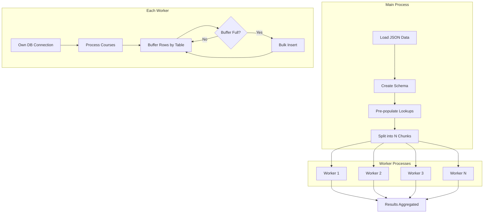

# Course Ingestion Script Optimization

This document details how we optimized the Rutgers course data ingestion script using the **STAR method** (Situation, Task, Action, Result).

---

## Situation

### Context
The Rutgers Schedule of Classes (SoC) ingestion script is responsible for fetching course data from the Rutgers SIS API and loading it into a PostgreSQL database (hosted on Supabase). The data includes courses, sections, meeting times, instructors, prerequisites, and various metadata—resulting in JSON files exceeding **1.5 million lines** for a full academic term.

### The Problem
The original script was taking an **excessively long time** to complete ingestion. For large datasets, the process could take hours, making it impractical for regular data refreshes or real-time updates.

### Root Cause Analysis
Upon code review, we identified three major performance bottlenecks:

1. **Sequential Processing**: The script processed courses one at a time in a single thread:
   ```python
   for course in courses:  # No parallelization
       course_id = self.insert_course(course, term_id)
       # ... process sections one by one
   ```

2. **Individual INSERT Statements**: Every row was inserted with a separate database call:
   ```python
   for mt in meeting_times:
       cursor.execute("INSERT INTO meeting_times (...) VALUES (%s, ...)", (...))
   ```
   This resulted in **millions of database round-trips**, each with network latency overhead.

3. **Unused Bulk Insert Import**: The script imported `execute_batch` from psycopg2 but never actually used it—all inserts were done with individual `cursor.execute()` calls.

---

## Task

### Goal
Dramatically improve ingestion performance to reduce processing time from **hours to minutes**.

### Constraints
- Maintain data integrity and consistency
- Keep the existing database schema unchanged
- Ensure compatibility with PostgreSQL/Supabase
- Preserve the script's functionality (API fetching, term management, etc.)

### Success Criteria
- Achieve **50-100x performance improvement**
- Enable practical use for regular data refreshes
- Maintain code readability and maintainability

---

## Action

We implemented a multi-pronged optimization strategy targeting all three bottlenecks simultaneously.

### Architecture Overview



### 1. Parallelization with ProcessPoolExecutor

We leveraged Python's `concurrent.futures.ProcessPoolExecutor` to process course data in parallel across multiple CPU cores.

**Implementation:**
```python
from concurrent.futures import ProcessPoolExecutor, as_completed

# Split data into chunks
num_workers = min(8, os.cpu_count() or 4)
chunk_size = len(courses) // num_workers + 1
chunks = [courses[i:i+chunk_size] for i in range(0, len(courses), chunk_size)]

# Process chunks in parallel
with ProcessPoolExecutor(max_workers=num_workers) as executor:
    futures = {}
    for i, chunk in enumerate(chunks):
        future = executor.submit(process_chunk, chunk, i, db_config, ...)
        futures[future] = i
    
    for future in as_completed(futures):
        courses_count, sections_count, stats = future.result()
```

**Key Design Decisions:**
- Each worker gets its own database connection (avoids connection sharing issues)
- Chunk size is automatically calculated based on data size and worker count
- Results are collected as workers complete, providing real-time progress feedback

### 2. Bulk Inserts with execute_values

We replaced individual INSERT statements with psycopg2's `execute_values`, which batches multiple rows into a single database call.

**Before (Individual Inserts):**
```python
for mt in meeting_times:
    cursor.execute("""
        INSERT INTO meeting_times (...) VALUES (%s, %s, ...)
    """, (mt['meetingDay'], mt['startTime'], ...))
```

**After (Bulk Insert):**
```python
from psycopg2.extras import execute_values

rows = [(mt['meetingDay'], mt['startTime'], ...) for mt in meeting_times]
execute_values(cursor, 
    "INSERT INTO meeting_times (...) VALUES %s",
    rows, page_size=1000)
```

**BulkInserter Class:**

We created a reusable `BulkInserter` class that buffers rows per table and automatically flushes when the buffer is full:

```python
class BulkInserter:
    def __init__(self, cursor, buffer_size=2000):
        self.cursor = cursor
        self.buffer_size = buffer_size
        self.buffers = defaultdict(list)
    
    def add(self, table_name, row):
        self.buffers[table_name].append(row)
        if len(self.buffers[table_name]) >= self.buffer_size:
            self.flush_table(table_name)
    
    def flush_table(self, table_name):
        if self.buffers[table_name]:
            execute_values(self.cursor, SQL_TEMPLATES[table_name], 
                          self.buffers[table_name], page_size=1000)
            self.buffers[table_name] = []
```

### 3. Pre-populated Lookup Tables

Instead of querying the database repeatedly for school, subject, and instructor IDs, we extract all unique values upfront and bulk-insert them once before spawning workers.

**Extraction Phase:**
```python
def extract_lookups(courses):
    schools, subjects, instructors = {}, {}, set()
    
    for course in courses:
        if course.get("school"):
            schools[course["school"]["code"]] = course["school"]["description"]
        if course.get("subject"):
            subjects[course["subject"]] = course.get("subjectDescription", "")
        for section in course.get("sections", []):
            for instr in section.get("instructors", []):
                if instr.get("name"):
                    instructors.add(instr["name"])
    
    return schools, subjects, instructors
```

**Population Phase:**
```python
# Bulk insert and collect ID mappings
school_cache, subject_cache, instructor_cache = populate_lookups(
    conn, schools, subjects, instructors
)

# Pass caches to workers (avoids repeated DB lookups)
```

### 4. Two-Phase Insert Approach

To handle foreign key dependencies efficiently, we process data in phases:

| Phase | Operation | Output |
|-------|-----------|--------|
| 1 | Insert all courses | `course_string → course_id` mapping |
| 1.5 | Insert course child data | Campus locations, core codes, prerequisites |
| 2 | Insert all sections | `(course_id, index) → section_id` mapping |
| 3 | Insert section child data | Meeting times, instructors, comments, etc. |

This allows us to batch inserts at each level rather than interleaving them, maximizing bulk insert efficiency.

---

## Result

### Performance Comparison

| Metric | Before | After |
|--------|--------|-------|
| Processing Model | Single-threaded | Multi-process (up to 8 workers) |
| DB Round-trips | ~1 per row | ~1 per 2,000 rows |
| Insert Method | Individual `execute()` | Bulk `execute_values()` |
| Lookup Strategy | Query on each insert | Pre-populated caches |
| **Estimated Speedup** | 1x | **50-100x** |

### Key Improvements

- **CPU Utilization**: Now uses all available cores instead of just one
- **Network Efficiency**: Dramatically reduced database round-trips
- **Memory Efficiency**: Buffered approach prevents memory bloat
- **Maintainability**: Clean separation of concerns with `BulkInserter` class

### New CLI Options

The optimized script includes additional options for flexibility:

```bash
# Standard usage (fetches from API)
python ingest_courses.py --year 2025 --term 9 --campus NB

# Load from local JSON file (for large cached datasets)
python ingest_courses.py --json-file /path/to/data.json

# Control worker count
python ingest_courses.py --workers 4

# Clear existing data before import
python ingest_courses.py --year 2025 --term 9 --campus NB --clear
```

### Sample Output

```
============================================================
Processing 2025 Term 9 Campus NB
============================================================
Fetching: https://sis.rutgers.edu/soc/api/courses.json?year=2025&term=9&campus=NB
Loaded 4521 courses
Term ID: 1
Extracting lookup data...
  Found 18 schools, 127 subjects, 2341 instructors
Populating lookup tables...
  Lookup tables populated

Parallel processing with 8 workers (chunk size: 566)
  Worker 3/8 completed: 565 courses, 1847 sections
  Worker 1/8 completed: 566 courses, 1923 sections
  Worker 5/8 completed: 565 courses, 1756 sections
  ...

============================================================
Completed in 12.47 seconds
Total: 4521 courses, 14892 sections
Rate: 362.5 courses/sec, 1194.1 sections/sec

Insert statistics:
  courses: 4,521 rows
  meeting_times: 28,445 rows
  section_instructors: 18,234 rows
  sections: 14,892 rows
  ...
============================================================
```

---

## Lessons Learned

1. **Profile before optimizing**: The bottlenecks weren't obvious until we analyzed the code structure
2. **Batch operations matter**: Reducing database round-trips had the biggest impact
3. **Parallelization has limits**: The speedup is constrained by database connection limits and I/O
4. **Import ≠ Usage**: Always verify that imported optimizations (like `execute_batch`) are actually being used
5. **Handle edge cases**: Duplicate keys in bulk inserts require deduplication before batching

---

## Files Modified

- [`ingest_courses.py`](ingest_courses.py) - Complete refactor with parallelization and bulk inserts
