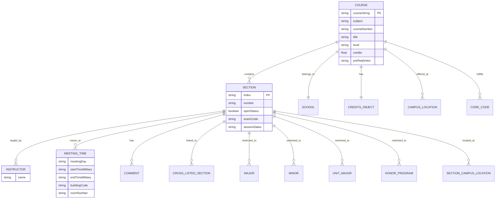

# Rutgers SIS API Data Structure Documentation

> Comprehensive reference for the Rutgers Schedule of Classes (SIS) API response format

---

## Table of Contents

1. [Executive Summary](#executive-summary)
2. [API Endpoint](#api-endpoint)
3. [Entity Relationships](#entity-relationships)
4. [Course Object (Root Level)](#course-object-root-level)
5. [Nested Objects](#nested-objects)
   - [school](#school-object)
   - [creditsObject](#creditsobject)
   - [campusLocations](#campuslocations-array)
   - [coreCodes](#corecodes-array)
   - [sections](#sections-array)
   - [instructors](#instructors-array)
   - [meetingTimes](#meetingtimes-array)
   - [comments](#comments-array)
   - [crossListedSections](#crosslistedsections-array)
   - [majors / minors](#majors--minors-arrays)
   - [unitMajors](#unitmajors-array)
   - [honorPrograms](#honorprograms-array)
6. [Enumeration Reference](#enumeration-reference)
7. [Complete Field Reference](#complete-field-reference)
8. [Data Statistics](#data-statistics)

---

## Executive Summary

The Rutgers SIS API provides comprehensive course catalog data for Rutgers University across all campuses (New Brunswick, Newark, Camden) and their online variants. The API returns a JSON array of course objects, each containing nested structures for sections, instructors, meeting times, and enrollment restrictions.

### Key Statistics

| Metric | Value |
|--------|-------|
| Total Courses (across all terms/campuses) | ~47,000 |
| Total Sections | ~110,000+ |
| Unique Instructors | ~8,000 |
| Unique Subjects | ~301 |
| Unique Schools | ~46 |
| Avg Sections per Course | 2.4 |
| Max Sections per Course | 128 |
| Avg Meeting Times per Section | 1.4 |
| Total Unique Fields | 134 |

---

## API Endpoint

### Base URL

```
https://sis.rutgers.edu/soc/api/courses.json
```

### Required Parameters

| Parameter | Type | Required | Description |
|-----------|------|----------|-------------|
| `year` | string | Yes | Academic year (e.g., `"2025"`) |
| `term` | string | Yes | Semester code: `0`=Winter, `1`=Spring, `7`=Summer, `9`=Fall |
| `campus` | string | Yes | Campus code: `NB`, `NK`, `CM`, `ONLINE_NB`, `ONLINE_NK`, `ONLINE_CM` |

### Example Request

```
GET https://sis.rutgers.edu/soc/api/courses.json?year=2025&term=1&campus=NB
```

### Response Format

```json
[
  { /* Course Object 1 */ },
  { /* Course Object 2 */ },
  ...
]
```

### Error Handling

| Condition | Response |
|-----------|----------|
| Missing required parameter | HTTP 400 Bad Request (HTML error page) |
| Invalid parameter value | HTTP 200 with empty array `[]` |
| Non-numeric year | HTTP 400 Bad Request |

### Additional Endpoint

```
GET https://sis.rutgers.edu/soc/api/openSections.json?year=2025&term=1&campus=NB
```

Returns an array of open section index numbers (strings) for quick availability checks.

---

## Entity Relationships



---

## Course Object (Root Level)

The root response is an array of course objects. Each course object contains the following fields:

### Identification Fields

| Field | Type | Required | Null Rate | Description | Sample Values |
|-------|------|----------|-----------|-------------|---------------|
| `courseString` | string | Yes | 0% | Unique course identifier in format `XX:XXX:XXX` | `"01:198:111"`, `"01:640:151"` |
| `subject` | string | Yes | 0% | 3-digit subject code | `"198"`, `"640"`, `"119"` |
| `courseNumber` | string | Yes | 0% | 3-digit course number | `"111"`, `"151"`, `"101"` |
| `offeringUnitCode` | string | Yes | 0% | 2-digit school/unit code | `"01"`, `"14"`, `"33"` |
| `supplementCode` | string | Yes | 0% | Supplement identifier (usually whitespace) | `"  "`, `"LB"`, `"NB"` |

### Title and Description Fields

| Field | Type | Required | Null Rate | Description | Sample Values |
|-------|------|----------|-----------|-------------|---------------|
| `title` | string | Yes | 0% | Short course title (max ~24 chars) | `"INTRO COMPUTER SCI"` |
| `expandedTitle` | string | Yes | 0% | Full course title (padded to 80 chars) | `"INTRODUCTION TO COMPUTER SCIENCE"` |
| `courseDescription` | string | Yes | 0% | Full catalog description | Long text or empty `""` |
| `synopsisUrl` | string | Yes | 0% | URL to department course descriptions | `"https://cs.rutgers.edu/..."` |

### Academic Classification

| Field | Type | Required | Null Rate | Description | Sample Values |
|-------|------|----------|-----------|-------------|---------------|
| `level` | string | Yes | 0% | Academic level | `"U"` (Undergraduate), `"G"` (Graduate) |
| `credits` | number/null | No | ~11% | Credit hours as decimal | `3`, `4`, `1.5`, `null` |
| `school` | object | Yes | 0% | School/college offering course | See [school object](#school-object) |
| `creditsObject` | object | Yes | 0% | Detailed credit information | See [creditsObject](#creditsobject) |

### Campus and Location

| Field | Type | Required | Null Rate | Description | Sample Values |
|-------|------|----------|-----------|-------------|---------------|
| `mainCampus` | string | Yes | 0% | Primary campus code | `"NB"`, `"NK"`, `"CM"` |
| `campusCode` | string | Yes | 0% | Campus code (may include online) | `"NB"`, `"OB"`, `"NK"`, `"ON"`, `"CM"`, `"OC"` |
| `campusLocations` | array | Yes | 0% | Physical locations where offered | See [campusLocations](#campuslocations-array) |

### Requirements and Notes

| Field | Type | Required | Null Rate | Description | Sample Values |
|-------|------|----------|-----------|-------------|---------------|
| `preReqNotes` | string | Yes | 0% | HTML-formatted prerequisite text | `"(01:640:151 CALC I)<em> OR </em>..."` |
| `coreCodes` | array | Yes | 0% | Core curriculum codes fulfilled | See [coreCodes](#corecodes-array) |
| `courseNotes` | string | Yes | 0% | Additional course notes | Registration instructions, etc. |
| `subjectNotes` | string | Yes | 0% | Notes for entire subject | Department policies |
| `subjectGroupNotes` | string | Yes | 0% | Notes for subject group | Usually empty |
| `unitNotes` | string | Yes | 0% | Notes for offering unit | Permission request URLs |

### Subject Information

| Field | Type | Required | Null Rate | Description | Sample Values |
|-------|------|----------|-----------|-------------|---------------|
| `subjectDescription` | string | Yes | 0% | Full subject name | `"Computer Science"`, `"Mathematics"` |

### Fees

| Field | Type | Required | Null Rate | Description | Sample Values |
|-------|------|----------|-----------|-------------|---------------|
| `courseFee` | string | Yes | 0% | Fee amount as string | `"0"`, `"105.00"`, `"54.00"` |
| `courseFeeDescr` | string/null | No | ~0.5% | Fee description | `"LAB FEE"`, `"COURSE FEE"` |

### Availability

| Field | Type | Required | Null Rate | Description | Sample Values |
|-------|------|----------|-----------|-------------|---------------|
| `openSections` | integer | Yes | 0% | Count of open sections | `0`, `1`, `5`, `12` |
| `sections` | array | Yes | 0% | All sections for this course | See [sections](#sections-array) |

### Unused/Reserved Fields

| Field | Type | Required | Null Rate | Description |
|-------|------|----------|-----------|-------------|
| `offeringUnitTitle` | null | No | 100% | Always null (unused) |

---

## Nested Objects

### school Object

Represents the school or college offering the course.

```json
{
  "code": "01",
  "description": "School of Arts and Sciences"
}
```

| Field | Type | Required | Description | Sample Values |
|-------|------|----------|-------------|---------------|
| `code` | string | Yes | 2-digit school code | `"01"`, `"14"`, `"33"` |
| `description` | string | Yes | Full school name | `"School of Arts and Sciences"`, `"School of Engineering"` |

### creditsObject

Detailed credit information with a coded representation.

```json
{
  "code": "3_0",
  "description": "3.0 credits"
}
```

| Field | Type | Required | Description | Sample Values |
|-------|------|----------|-------------|---------------|
| `code` | string | Yes | Credit code | `"3_0"`, `"4_0"`, `"1_5"`, `"BA"` |
| `description` | string | Yes | Human-readable credit text | `"3.0 credits"`, `"Credits by arrangement"` |

**Credit Codes:**
- `X_Y` format: X.Y credits (e.g., `"3_0"` = 3.0 credits)
- `"BA"`: Credits by arrangement

### campusLocations Array

Physical campus locations where the course is offered.

```json
[
  {
    "code": "2",
    "description": "Busch"
  },
  {
    "code": "1",
    "description": "College Avenue"
  }
]
```

| Field | Type | Required | Description | Sample Values |
|-------|------|----------|-------------|---------------|
| `code` | string | Yes | Location code | `"1"`, `"2"`, `"3"`, `"O"`, `"NA"` |
| `description` | string | Yes | Location name | `"College Avenue"`, `"Busch"`, `"Livingston"` |

**Location Codes (New Brunswick):**
- `1`: College Avenue
- `2`: Busch
- `3`: Livingston
- `4`: Cook/Douglass
- `5`: Downtown New Brunswick
- `O`: Online
- `S`: Study Abroad
- `NA`: N/A

### coreCodes Array

Core curriculum requirements fulfilled by this course.

```json
[
  {
    "id": "2025101198111  17",
    "year": "2025",
    "term": "1",
    "code": "AHp",
    "coreCode": "AHp",
    "description": "Arts and Literatures",
    "coreCodeDescription": "Arts and Literatures",
    "coreCodeReferenceId": "17",
    "effective": "20251",
    "lastUpdated": 1468423723000,
    "unit": "01",
    "subject": "198",
    "course": "111",
    "offeringUnitCode": "01",
    "offeringUnitCampus": "NB",
    "supplement": "  "
  }
]
```

| Field | Type | Required | Description | Sample Values |
|-------|------|----------|-------------|---------------|
| `id` | string | Yes | Unique composite ID | `"2025101198111  17"` |
| `year` | string | Yes | Academic year | `"2025"` |
| `term` | string | Yes | Semester code | `"1"`, `"9"` |
| `code` | string | Yes | Core code abbreviation | `"AHp"`, `"HST"`, `"QQ"` |
| `coreCode` | string | Yes | Same as `code` | `"AHp"` |
| `description` | string | Yes | Full requirement name | `"Arts and Literatures"` |
| `coreCodeDescription` | string | Yes | Same as `description` | `"Arts and Literatures"` |
| `coreCodeReferenceId` | string | Yes | Reference ID | `"17"`, `"20"` |
| `effective` | string | Yes | Effective term (YYYYT) | `"20251"` |
| `lastUpdated` | integer | Yes | Unix timestamp (ms) | `1468423723000` |
| `unit` | string | Yes | School unit code | `"01"` |
| `subject` | string | Yes | Subject code | `"198"` |
| `course` | string | Yes | Course number | `"111"` |
| `offeringUnitCode` | string | Yes | Offering unit | `"01"` |
| `offeringUnitCampus` | string | Yes | Campus | `"NB"` |
| `supplement` | string | Yes | Supplement code | `"  "` |

**Common Core Codes:**
- `AHo`: Philosophical and Theoretical Issues
- `AHp`: Arts and Literatures
- `AHq`: Nature of Languages
- `AHr`: Oral and Written Communication
- `CCD`: Diversities and Social Inequalities
- `CCO`: Our Common Future
- `HST`: Historical Analysis
- `NS`: Natural Sciences
- `QQ`: Quantitative Information
- `QR`: Quantitative and Mathematical Reasoning
- `SCL`: Social Analysis
- `WC`: Writing in a Discipline
- `SOEHS`: SOE Humanities/Social Science (Engineering)

---

### sections Array

Individual class sections for this course. This is the most complex nested structure.

```json
{
  "index": "09214",
  "number": "01",
  "openStatus": true,
  "openStatusText": "OPEN",
  "instructors": [...],
  "meetingTimes": [...],
  "examCode": "T",
  "sessionDates": "07/07/2025 - 08/01/2025",
  ...
}
```

#### Section Identification

| Field | Type | Required | Null Rate | Description | Sample Values |
|-------|------|----------|-----------|-------------|---------------|
| `index` | string | Yes | 0% | 5-digit registration index | `"09214"`, `"12345"` |
| `number` | string | Yes | 0% | Section number | `"01"`, `"02"`, `"90"`, `"M1"` |

#### Availability Status

| Field | Type | Required | Null Rate | Description | Sample Values |
|-------|------|----------|-----------|-------------|---------------|
| `openStatus` | boolean | Yes | 0% | Is section open for registration | `true`, `false` |
| `openStatusText` | string | Yes | 0% | Text representation | `"OPEN"`, `"CLOSED"` |

#### Section Type and Format

| Field | Type | Required | Null Rate | Description | Sample Values |
|-------|------|----------|-----------|-------------|---------------|
| `sectionCourseType` | string | Yes | 0% | Delivery type code | `"T"`, `"H"`, `"O"` |
| `printed` | string | Yes | 0% | Print in schedule | `"Y"` |
| `campusCode` | string | Yes | 0% | Campus for this section | `"NB"`, `"OB"` |

**Section Course Types:**
- `T`: Traditional (in-person)
- `H`: Hybrid (mixed online/in-person)
- `O`: Online

#### Dates and Exams

| Field | Type | Required | Null Rate | Description | Sample Values |
|-------|------|----------|-----------|-------------|---------------|
| `sessionDates` | string/null | No | ~92% | Session date range (Summer only) | `"07/07/2025 - 08/01/2025"` |
| `sessionDatePrintIndicator` | string | Yes | 0% | Print session dates | `"Y"`, `"N"` |
| `examCode` | string | Yes | 0% | Final exam code | `"A"`, `"C"`, `"O"`, `"T"` |
| `examCodeText` | string | Yes | 0% | Exam code description | `"By arrangement"`, `"No final exam"` |
| `finalExam` | string/null | No | ~67% | Scheduled final exam time | `"12/16/2025 12:00PM-03:00PM"` |

**Exam Codes:**
- `A`: By arrangement
- `B`: Saturday evening
- `C`: During class hour
- `D`: Common hour
- `F`: Friday exams
- `G`: Spanish
- `H`: See instructor
- `I`, `J`: Special
- `M`: Monday evening
- `N`: No final exam
- `O`: No final exam
- `Q`: Quiz
- `S`: See instructor
- `T`: Tuesday evening
- `U`: Thursday evening

#### Notes and Restrictions

| Field | Type | Required | Null Rate | Description | Sample Values |
|-------|------|----------|-----------|-------------|---------------|
| `sectionNotes` | string | Yes | 0% | Section-specific notes | `"PREREQ: 01:640:151"` |
| `sectionEligibility` | string | Yes | 0% | Class standing requirement | `"JUNIORS AND SENIORS"`, `""` |
| `subtitle` | string | Yes | 0% | Section subtitle/topic | `"MACHINE LEARNING"` |
| `subtopic` | string | Yes | 0% | Extended topic description | Long text or `""` |

#### Special Permissions

| Field | Type | Required | Null Rate | Description | Sample Values |
|-------|------|----------|-----------|-------------|---------------|
| `specialPermissionAddCode` | string/null | No | ~74% | Permission code to add | `"04"`, `"03"` |
| `specialPermissionAddCodeDescription` | string/null | No | ~74% | Who grants permission | `"Instructor"`, `"Department"` |
| `specialPermissionDropCode` | string/null | No | ~94% | Permission code to drop | `"3"`, `"2"` |
| `specialPermissionDropCodeDescription` | string/null | No | ~94% | Drop permission description | `"3"`, `"2"` |

#### Cross-Listing

| Field | Type | Required | Null Rate | Description | Sample Values |
|-------|------|----------|-----------|-------------|---------------|
| `crossListedSectionType` | string | Yes | 0% | Cross-list type code | `"0"` - `"6"` |
| `crossListedSections` | array | Yes | 0% | Cross-listed sections | See [crossListedSections](#crosslistedsections-array) |
| `crossListedSectionsText` | string | Yes | 0% | Formatted cross-list text | `"01:198:111:01 (09215)"` |

#### Fees (Section Level)

| Field | Type | Required | Null Rate | Description | Sample Values |
|-------|------|----------|-----------|-------------|---------------|
| `courseFee` | string/null | No | ~28% | Section fee amount | `"0000.00"`, `"0105.00"` |
| `courseFeeDescr` | string/null | No | ~97% | Fee description | `"LAB FEE"` |

#### Enrollment Restrictions

| Field | Type | Required | Null Rate | Description | Sample Values |
|-------|------|----------|-----------|-------------|---------------|
| `openToText` | string | Yes | 0% | Restriction summary | `"MAJ: 198 (Computer Science)"` |
| `majors` | array | Yes | 0% | Major restrictions | See [majors](#majors--minors-arrays) |
| `minors` | array | Yes | 0% | Minor restrictions | See [minors](#majors--minors-arrays) |
| `unitMajors` | array | Yes | 0% | Unit+Major combos | See [unitMajors](#unitmajors-array) |
| `honorPrograms` | array | Yes | 0% | Honors restrictions | See [honorPrograms](#honorprograms-array) |

#### Nested Arrays

| Field | Type | Required | Description |
|-------|------|----------|-------------|
| `instructors` | array | Yes | Section instructors |
| `meetingTimes` | array | Yes | When/where section meets |
| `comments` | array | Yes | Section comments/notes |
| `sectionCampusLocations` | array | Yes | Campus locations for section |

#### Computed/Display Fields

| Field | Type | Required | Description | Sample Values |
|-------|------|----------|-------------|---------------|
| `instructorsText` | string | Yes | Comma-separated instructor names | `"SMITH, JOHN"` |
| `commentsText` | string | Yes | Comma-separated comments | `"Online Course, Go to canvas"` |
| `legendKey` | string/null | No | Legend marker (~0%) | `"*"` |

---

### instructors Array

Instructors assigned to teach a section.

```json
[
  {
    "name": "SMITH, JOHN"
  }
]
```

| Field | Type | Required | Description | Sample Values |
|-------|------|----------|-------------|---------------|
| `name` | string | Yes | Instructor name (LAST, FIRST) | `"SMITH, JOHN"`, `"HABERL, CHARLES"` |

**Statistics:**
- Avg instructors per section: ~1.0
- Max instructors per section: 2
- ~7,978 unique instructors

---

### meetingTimes Array

When and where a section meets. Multiple entries for different days/times.

```json
[
  {
    "meetingDay": "M",
    "startTimeMilitary": "1020",
    "endTimeMilitary": "1140",
    "startTime": "1020",
    "endTime": "1140",
    "pmCode": "A",
    "baClassHours": "",
    "meetingModeCode": "02",
    "meetingModeDesc": "LEC",
    "buildingCode": "HLL",
    "roomNumber": "116",
    "campusLocation": "2",
    "campusAbbrev": "BUS",
    "campusName": "BUSCH"
  }
]
```

#### Time Fields

| Field | Type | Required | Description | Sample Values |
|-------|------|----------|-------------|---------------|
| `meetingDay` | string | Yes | Day of week code | `"M"`, `"T"`, `"W"`, `"H"`, `"F"`, `"S"`, `"U"`, `""` |
| `startTimeMilitary` | string | Yes | Start time (24hr, HHMM) | `"0900"`, `"1340"`, `""` |
| `endTimeMilitary` | string | Yes | End time (24hr, HHMM) | `"1020"`, `"1500"`, `""` |
| `startTime` | string | Yes | Start time (12hr format) | `"0900"`, `"0140"` |
| `endTime` | string | Yes | End time (12hr format) | `"1020"`, `"0300"` |
| `pmCode` | string | Yes | AM/PM indicator | `"A"` (AM), `"P"` (PM), `""` |
| `baClassHours` | string | Yes | Class hours type | `"A"`, `"B"`, `""` |

**Meeting Day Codes:**
- `M`: Monday
- `T`: Tuesday
- `W`: Wednesday
- `H`: Thursday
- `F`: Friday
- `S`: Saturday
- `U`: Sunday
- `""`: Asynchronous/TBA

#### Location Fields

| Field | Type | Required | Description | Sample Values |
|-------|------|----------|-------------|---------------|
| `buildingCode` | string | Yes | Building abbreviation | `"HLL"`, `"SEC"`, `"ARC"`, `""` |
| `roomNumber` | string | Yes | Room number | `"116"`, `"111"`, `""` |
| `campusLocation` | string | Yes | Campus location code | `"1"`, `"2"`, `"3"`, `"O"` |
| `campusAbbrev` | string | Yes | Campus abbreviation | `"CAC"`, `"BUS"`, `"LIV"`, `"**"` |
| `campusName` | string | Yes | Full campus name | `"COLLEGE AVENUE"`, `"BUSCH"` |

**Campus Abbreviations:**
- `CAC`: College Avenue
- `BUS`: Busch
- `LIV`: Livingston
- `D/C`: Cook/Douglass
- `DNB`: Downtown New Brunswick
- `**`: Online/Invalid

#### Meeting Mode

| Field | Type | Required | Description | Sample Values |
|-------|------|----------|-------------|---------------|
| `meetingModeCode` | string | Yes | Mode code | `"02"`, `"05"`, `"90"` |
| `meetingModeDesc` | string | Yes | Mode description | `"LEC"`, `"LAB"`, `"REC"` |

**Common Meeting Modes:**
- `02` (LEC): Lecture
- `03` (SEM): Seminar
- `04` (REC): Recitation
- `05` (LAB): Laboratory
- `06` (STU): Studio
- `15` (INTERNSP): Internship
- `19` (PROJ-IND): Independent Project
- `28` (FILM): Film
- `29` (STUDY ABROAD): Study Abroad
- `90` (ONLINE): Online Instruction

**Statistics:**
- Avg meeting times per section: 1.4
- Max meeting times per section: 5

---

### comments Array

Comments or special notes for a section.

```json
[
  {
    "code": "56",
    "description": "Online Course"
  },
  {
    "code": "05",
    "description": "Go to http://canvas.rutgers.edu"
  }
]
```

| Field | Type | Required | Description | Sample Values |
|-------|------|----------|-------------|---------------|
| `code` | string | Yes | Comment code | `"56"`, `"05"`, `"23"` |
| `description` | string | Yes | Comment text | `"Online Course"`, `"Hybrid Section"` |

**Common Comment Codes:**
- `05`: Go to http://canvas.rutgers.edu
- `23`: Hybrid Section - Some Meetings Online
- `56`: Online Course
- `AU`: First-year students welcome
- `AK`: Please contact department for tech requirements
- `AL`: Course may require: Webcam, Microphone
- `AQ`: Big Ten Academic Alliance CourseShare

---

### crossListedSections Array

Sections that are cross-listed (equivalent courses in different departments).

```json
[
  {
    "offeringUnitCode": "01",
    "offeringUnitCampus": "NB",
    "subjectCode": "198",
    "courseNumber": "111",
    "supplementCode": "  ",
    "sectionNumber": "01",
    "registrationIndex": "09215",
    "primaryRegistrationIndex": "09214"
  }
]
```

| Field | Type | Required | Description | Sample Values |
|-------|------|----------|-------------|---------------|
| `offeringUnitCode` | string | Yes | Unit code | `"01"` |
| `offeringUnitCampus` | string | Yes | Campus | `"NB"` |
| `subjectCode` | string | Yes | Subject | `"198"` |
| `courseNumber` | string | Yes | Course number | `"111"` |
| `supplementCode` | string | Yes | Supplement | `"  "` |
| `sectionNumber` | string | Yes | Section number | `"01"` |
| `registrationIndex` | string | Yes | Index for this cross-list | `"09215"` |
| `primaryRegistrationIndex` | string | Yes | Primary section index | `"09214"` |

---

### majors / minors Arrays

Enrollment restrictions by major or minor.

```json
{
  "code": "198",
  "isMajorCode": true,
  "isUnitCode": false
}
```

| Field | Type | Required | Description | Sample Values |
|-------|------|----------|-------------|---------------|
| `code` | string | Yes | Major/minor/unit code | `"198"`, `"01"` |
| `isMajorCode` | boolean | Yes | Is this a major code | `true`, `false` |
| `isUnitCode` | boolean | Yes | Is this a unit code | `true`, `false` |

---

### unitMajors Array

Combined unit and major restrictions.

```json
{
  "unitCode": "14",
  "majorCode": "198"
}
```

| Field | Type | Required | Description | Sample Values |
|-------|------|----------|-------------|---------------|
| `unitCode` | string | Yes | School unit code | `"14"`, `"01"` |
| `majorCode` | string | Yes | Major code | `"198"`, `"640"` |

---

### honorPrograms Array

Honors program restrictions.

```json
{
  "code": "A"
}
```

| Field | Type | Required | Description | Sample Values |
|-------|------|----------|-------------|---------------|
| `code` | string | Yes | Honor program code | `"A"`, `"7"`, `"8"`, `"D"`, `"E"` |

---

## Enumeration Reference

### Term Codes

| Code | Term | Typical Course Count |
|------|------|---------------------|
| `0` | Winter | ~600 |
| `1` | Spring | ~21,500 |
| `7` | Summer | ~5,300 |
| `9` | Fall | ~19,700 |

### Campus Codes

| Code | Campus | Description |
|------|--------|-------------|
| `NB` | New Brunswick | Main New Brunswick campus |
| `NK` | Newark | Newark campus |
| `CM` | Camden | Camden campus |
| `ONLINE_NB` | Online - NB | New Brunswick online courses |
| `ONLINE_NK` | Online - NK | Newark online courses |
| `ONLINE_CM` | Online - CM | Camden online courses |

### Internal Campus Codes (in data)

| Code | Description |
|------|-------------|
| `NB` | New Brunswick (in-person) |
| `OB` | New Brunswick (online) |
| `NK` | Newark (in-person) |
| `ON` | Newark (online) |
| `CM` | Camden (in-person) |
| `OC` | Camden (online) |

### Academic Level

| Code | Description |
|------|-------------|
| `U` | Undergraduate |
| `G` | Graduate |

### Section Course Type

| Code | Description |
|------|-------------|
| `T` | Traditional (in-person) |
| `H` | Hybrid |
| `O` | Online |

### Open Status

| Code | Description |
|------|-------------|
| `OPEN` | Section accepting registrations |
| `CLOSED` | Section full or restricted |

### Meeting Day

| Code | Day |
|------|-----|
| `M` | Monday |
| `T` | Tuesday |
| `W` | Wednesday |
| `H` | Thursday |
| `F` | Friday |
| `S` | Saturday |
| `U` | Sunday |
| `""` | Asynchronous/TBA |

### PM Code

| Code | Description |
|------|-------------|
| `A` | AM |
| `P` | PM |
| `""` | Not applicable |

### Cross-Listed Section Type

| Code | Description |
|------|-------------|
| `0` | Not cross-listed |
| `1` | Primary section |
| `2` | Secondary cross-list |
| `3`-`6` | Additional cross-list levels |

---

## Complete Field Reference

All 134 unique fields discovered through comprehensive fuzzing:

### Course Level (26 fields)

| # | Path | Type | Required | Null Rate |
|---|------|------|----------|-----------|
| 1 | `campusCode` | string | Yes | 0% |
| 2 | `campusLocations` | array | Yes | 0% |
| 3 | `coreCodes` | array | Yes | 0% |
| 4 | `courseDescription` | string | Yes | 0% |
| 5 | `courseFee` | string | Yes | 0% |
| 6 | `courseFeeDescr` | string/null | No | 0.5% |
| 7 | `courseNotes` | string | Yes | 0% |
| 8 | `courseNumber` | string | Yes | 0% |
| 9 | `courseString` | string | Yes | 0% |
| 10 | `credits` | number/null | No | 11% |
| 11 | `creditsObject` | object | Yes | 0% |
| 12 | `expandedTitle` | string | Yes | 0% |
| 13 | `level` | string | Yes | 0% |
| 14 | `mainCampus` | string | Yes | 0% |
| 15 | `offeringUnitCode` | string | Yes | 0% |
| 16 | `offeringUnitTitle` | null | No | 100% |
| 17 | `openSections` | integer | Yes | 0% |
| 18 | `preReqNotes` | string | Yes | 0% |
| 19 | `school` | object | Yes | 0% |
| 20 | `sections` | array | Yes | 0% |
| 21 | `subject` | string | Yes | 0% |
| 22 | `subjectDescription` | string | Yes | 0% |
| 23 | `subjectGroupNotes` | string | Yes | 0% |
| 24 | `subjectNotes` | string | Yes | 0% |
| 25 | `supplementCode` | string | Yes | 0% |
| 26 | `synopsisUrl` | string | Yes | 0% |
| 27 | `title` | string | Yes | 0% |
| 28 | `unitNotes` | string | Yes | 0% |

### Section Level (35 fields)

| # | Path | Type | Required | Null Rate |
|---|------|------|----------|-----------|
| 1 | `sections[*].campusCode` | string | Yes | 0% |
| 2 | `sections[*].comments` | array | Yes | 0% |
| 3 | `sections[*].commentsText` | string | Yes | 0% |
| 4 | `sections[*].courseFee` | string/null | No | 28% |
| 5 | `sections[*].courseFeeDescr` | string/null | No | 97% |
| 6 | `sections[*].crossListedSections` | array | Yes | 0% |
| 7 | `sections[*].crossListedSectionsText` | string | Yes | 0% |
| 8 | `sections[*].crossListedSectionType` | string | Yes | 0% |
| 9 | `sections[*].examCode` | string | Yes | 0% |
| 10 | `sections[*].examCodeText` | string | Yes | 0% |
| 11 | `sections[*].finalExam` | string/null | No | 67% |
| 12 | `sections[*].honorPrograms` | array | Yes | 0% |
| 13 | `sections[*].index` | string | Yes | 0% |
| 14 | `sections[*].instructors` | array | Yes | 0% |
| 15 | `sections[*].instructorsText` | string | Yes | 0% |
| 16 | `sections[*].legendKey` | string/null | No | 99.99% |
| 17 | `sections[*].majors` | array | Yes | 0% |
| 18 | `sections[*].meetingTimes` | array | Yes | 0% |
| 19 | `sections[*].minors` | array | Yes | 0% |
| 20 | `sections[*].number` | string | Yes | 0% |
| 21 | `sections[*].openStatus` | boolean | Yes | 0% |
| 22 | `sections[*].openStatusText` | string | Yes | 0% |
| 23 | `sections[*].openToText` | string | Yes | 0% |
| 24 | `sections[*].printed` | string | Yes | 0% |
| 25 | `sections[*].sectionCampusLocations` | array | Yes | 0% |
| 26 | `sections[*].sectionCourseType` | string | Yes | 0% |
| 27 | `sections[*].sectionEligibility` | string | Yes | 0% |
| 28 | `sections[*].sectionNotes` | string | Yes | 0% |
| 29 | `sections[*].sessionDatePrintIndicator` | string | Yes | 0% |
| 30 | `sections[*].sessionDates` | string/null | No | 92% |
| 31 | `sections[*].specialPermissionAddCode` | string/null | No | 74% |
| 32 | `sections[*].specialPermissionAddCodeDescription` | string/null | No | 74% |
| 33 | `sections[*].specialPermissionDropCode` | string/null | No | 94% |
| 34 | `sections[*].specialPermissionDropCodeDescription` | string/null | No | 94% |
| 35 | `sections[*].subtitle` | string | Yes | 0% |
| 36 | `sections[*].subtopic` | string | Yes | 0% |
| 37 | `sections[*].unitMajors` | array | Yes | 0% |

### Meeting Times (14 fields)

| Path | Type |
|------|------|
| `sections[*].meetingTimes[*].baClassHours` | string |
| `sections[*].meetingTimes[*].buildingCode` | string |
| `sections[*].meetingTimes[*].campusAbbrev` | string |
| `sections[*].meetingTimes[*].campusLocation` | string |
| `sections[*].meetingTimes[*].campusName` | string |
| `sections[*].meetingTimes[*].endTime` | string |
| `sections[*].meetingTimes[*].endTimeMilitary` | string |
| `sections[*].meetingTimes[*].meetingDay` | string |
| `sections[*].meetingTimes[*].meetingModeCode` | string |
| `sections[*].meetingTimes[*].meetingModeDesc` | string |
| `sections[*].meetingTimes[*].pmCode` | string |
| `sections[*].meetingTimes[*].roomNumber` | string |
| `sections[*].meetingTimes[*].startTime` | string |
| `sections[*].meetingTimes[*].startTimeMilitary` | string |

---

## Data Statistics

### Course Distribution by Campus (2025 Spring)

| Campus | Courses |
|--------|---------|
| New Brunswick | ~4,500 |
| Newark | ~1,300 |
| Camden | ~900 |

### Array Field Statistics

| Field | Avg Length | Max Length |
|-------|------------|------------|
| `sections` | 2.4 | 128 |
| `campusLocations` | 1.1 | 5 |
| `coreCodes` | 0.3 | 6 |
| `instructors` | 1.0 | 2 |
| `meetingTimes` | 1.4 | 5 |
| `comments` | 0.6 | 4 |
| `crossListedSections` | 0.08 | 4 |
| `majors` | 0.4 | 7 |
| `minors` | 0.02 | 2 |
| `honorPrograms` | 0.02 | 5 |
| `unitMajors` | 0.14 | 4 |

### Prerequisite Data

- ~28% of courses have prerequisites
- Prerequisites are stored as HTML in `preReqNotes`
- Pattern: `(COURSE_CODE COURSE_NAME)<em> OR </em>(COURSE_CODE COURSE_NAME)`

**Example:**
```html
(01:640:151 CALC I )<em> OR </em>(01:640:153 CALC I HONORS )<em> OR </em>(01:640:191 HONORS CALC I )
```

---

## Changelog

| Date | Version | Changes |
|------|---------|---------|
| 2026-01-10 | 1.0 | Initial documentation based on comprehensive API fuzzing |

---

*Generated from analysis of ~47,000 courses across 39 term/campus/year combinations.*
